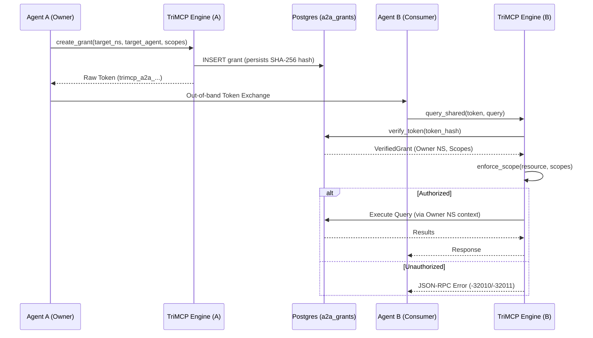

# Agent-to-Agent (A2A) Protocol

The Agent-to-Agent (A2A) Protocol (Phase 3.1) is a specialized framework for secure, scoped memory sharing between independent AI agents. It allows Agent A to grant specific permissions to Agent B to access portions of its memory or Knowledge Graph without compromising full namespace isolation.

## The Cryptographic Handshake

Sharing is initiated via a handshake that produces a secure, single-use sharing token.

### A2A Sharing Signal Flow

## Scopes and Permissions

A grant is defined by one or more **scopes**. A scope specifies exactly what is being shared:

-   **`namespace`**: Grants access to the entire memory store of the owner.
-   **`memory`**: Grants access to a specific UUID-identified memory.
-   **`kg_node`**: Grants access to a specific Knowledge Graph node and its immediate neighbors.
-   **`subgraph`**: Grants access to a recursively defined subgraph.

Currently, the protocol only supports `read` permissions.

## Security Controls

1.  **Token Hashing**: The raw sharing token is never stored in the database. TriMCP only stores the SHA-256 hash, making it impossible to reconstruct tokens from a database leak.
2.  **Binding Constraints**: Grants can be optionally restricted to a specific receiving `namespace_id` or `agent_id`, preventing unauthorized agents from using an intercepted token.
3.  **Auto-Expiration**: All tokens have a mandatory expiration window (default 1 hour, max 30 days).
4.  **Instant Revocation**: Owners can revoke a grant at any time via the `revoke_grant` tool, instantly invalidating the token.

## Integration

The A2A protocol is exposed via the **A2A Server** (`trimcp/a2a_server.py`), which implements a Starlette-based JSON-RPC 2.0 interface. This allows agents to communicate across network boundaries or even between different TriMCP deployments.
