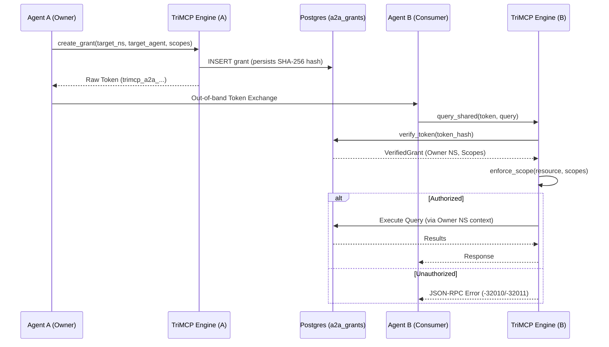

# Agent-to-Agent (A2A) Protocol

The Agent-to-Agent (A2A) Protocol (Phase 3.1) is a specialized framework for secure, scoped memory sharing between independent AI agents. It allows Agent A to grant specific permissions to Agent B to access portions of its memory or Knowledge Graph without compromising full namespace isolation.

## The Cryptographic Handshake

Sharing is initiated via a handshake that produces a secure, single-use sharing token.

### A2A Sharing Signal Flow

## Scopes and Permissions

A grant is defined by one or more **scopes**. A scope specifies exactly what is being shared:

-   **`namespace`**: Grants access to the entire memory store of the owner.
-   **`memory`**: Grants access to a specific UUID-identified memory.
-   **`kg_node`**: Grants access to a specific Knowledge Graph node and its immediate neighbors.
-   **`subgraph`**: Grants access to a recursively defined subgraph.

Currently, the protocol only supports `read` permissions.

## Security Controls

1.  **Token Hashing**: The raw sharing token is never stored in the database. TriMCP only stores the SHA-256 hash, making it impossible to reconstruct tokens from a database leak.
2.  **Binding Constraints**: Grants can be optionally restricted to a specific receiving `namespace_id` or `agent_id`, preventing unauthorized agents from using an intercepted token.
3.  **Auto-Expiration**: All tokens have a mandatory expiration window (default 1 hour, max 30 days).
4.  **Instant Revocation**: Owners can revoke a grant at any time via the `revoke_grant` tool, instantly invalidating the token.

## Enriched A2A Lifecycle Management (Phase 3.1 Extensions)

To align with enterprise-grade requirements, the A2A protocol includes advanced, tenant-isolated operations for managing, mutating, and auditing active grants:

### 1. Verification of Grant Status (`a2a_verify_grant_status`)
Enables agents to safely check the validity, active scopes, status, and expiration of a grant at runtime:
- **Tenant Isolation**: Protected by strict `NamespaceContext` boundaries. Callers must be either the owner or the explicitly declared target of the grant.
- **Auto-Expiration sweeps**: Performs a timezone-aware check on every lookup, transitioning expired active tokens automatically to `expired` status in the PostgreSQL store.
- **Crypto Safety**: Does not leak the SHA-256 token hash in the response.

### 2. Scope Mutation (`a2a_update_grant_scopes`)
Allows owners to dynamically mutate the scope mapping of an active grant without regenerating the cryptographic key:
- **Modes**:
  - `replace`: Replaces all existing scopes with the new list.
  - `append`: Performs a unique union-merge, appending new scopes without creating duplicate entries.
- **Auditing**: Generates a secure `a2a_grant_updated` event inside the tamper-resistant system event log.
- **Validation**: Enforces that grants must retain at least one valid scope and blocks modifications to inactive/revoked/expired records.

### 3. Grant Inspection (`a2a_inspect_grant`)
Allows the owning agent to safely retrieve a detailed, structured audit log of a grant's metadata. Sensitive cryptographic token hashes are never exposed, making this tool fully safe for automated compliance logging and security scanning.

## Runtime Control & Interceptors

All A2A network skills are subject to real-time administrative toggles. If an administrator disables a skill (e.g. `recall_relevant_context`) from the Tools Control Dashboard:
- The A2A routing layer instantly intercepts inbound dispatches inside `a2a_server.py`.
- Unauthorized requests are rejected with code `-32011` / HTTP 403 (Scope violation).
- If Redis is down, a fail-safe block intercepts the exception and defaults the dispatch to permitted/allowed to maintain continuous operations.
