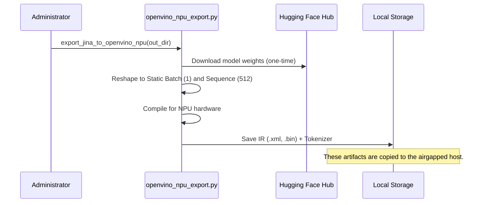

# Airgapped and Edge Deployment

TriMCP is designed for high-sovereignty environments where data must never leave the local network. It supports full offline operation and hardware-accelerated local inference.

## The Local Inference Stack

In airgapped mode, TriMCP replaces external API dependencies with local equivalents:

1.  **Local Embeddings**: Uses the `jinaai/jina-embeddings-v2-base-code` model running locally.
2.  **Local Cognitive Model**: Uses models like Llama 3 or Mistral running via a `local-cognitive-model` provider (compatible with Ollama or `llama.cpp`).
3.  **Local Databases**: All data persists in locally-hosted PostgreSQL, MongoDB, and MinIO instances.

## Hardware Acceleration: Intel OpenVINO

To achieve production-grade performance on edge hardware without discrete GPUs, TriMCP integrates with the **Intel OpenVINO** toolkit. This allows embedding models to run on the **Integrated GPU** or **Intel NPU**.

### Model Export Signal Flow

Before deployment to an airgapped system, models must be exported with **static input shapes** required by NPUs.



## Configuration for Airgapped Mode

To enable full offline operation, configure the following environment variables:

```bash
# Enable offline mode (blocks external HTTP attempts)
TRIMCP_OFFLINE_MODE=true

# Set hardware backend to OpenVINO
TRIMCP_BACKEND=openvino_npu

# Path to the exported model directory
TRIMCP_OPENVINO_MODEL_DIR=/opt/trimcp/models/jina-v2-npu

# Base URL for the local cognitive model (e.g., Ollama sidecar)
TRIMCP_COGNITIVE_BASE_URL=http://localhost:11435
```

## Data Sovereignty and Security

-   **Zero Telemetry**: TriMCP does not phone home.
-   **On-Premise Storage**: All memory payloads and Knowledge Graph data remain within the boundary of your infrastructure.
-   **Auditability**: The cryptographic signing layer remains active, ensuring the integrity of local data and providing a verifiable audit trail of all agent interactions.
