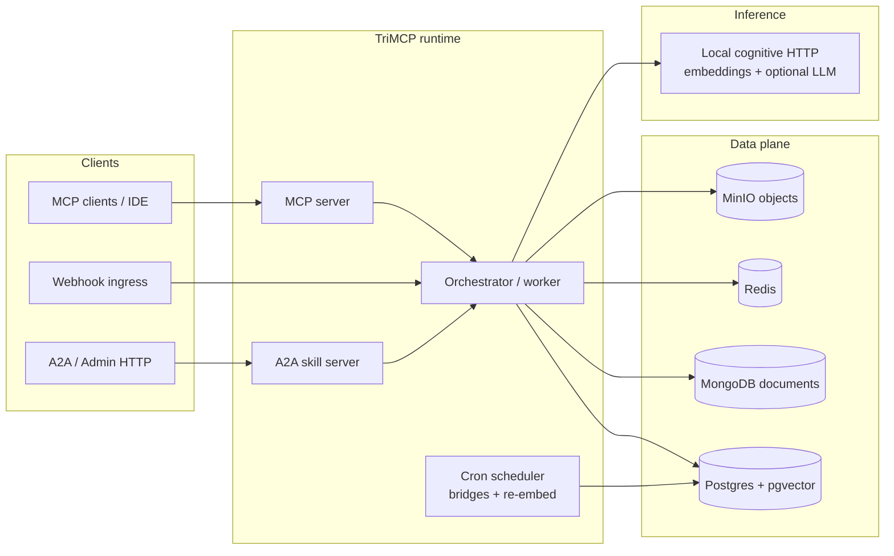
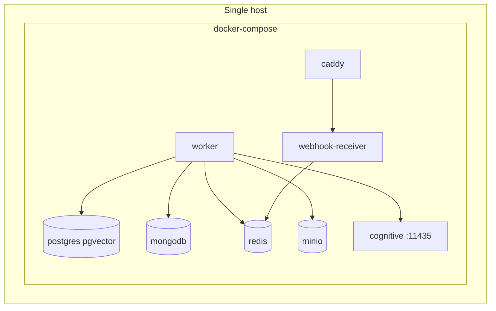
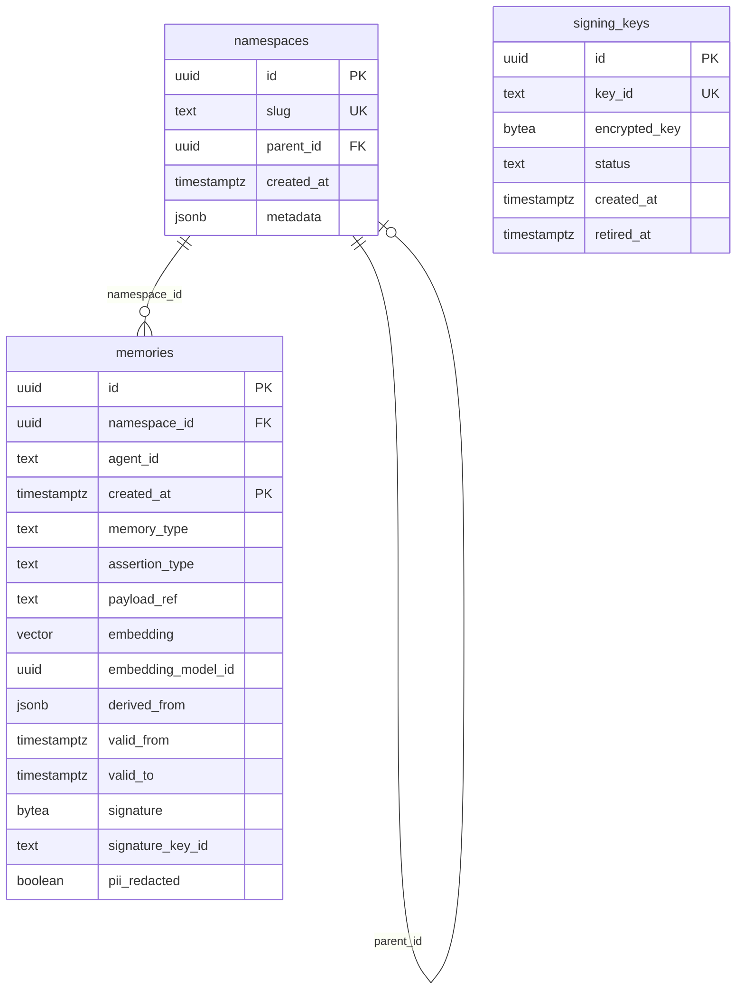
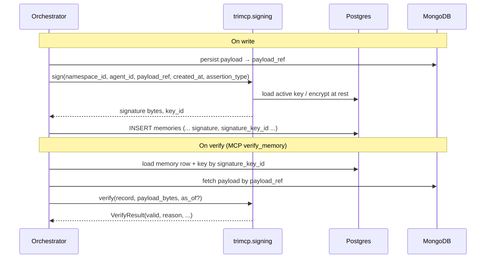

# TriMCP Phase 0.1 & 0.2 — Architecture

> **v1.0 runtime extensions** (temporal `as_of` queries, A2A sharing, cron workers, MCP replay): see **[architecture-v1.md](./architecture-v1.md)** — the diagrams there are the canonical view of those subsystems alongside this Phase 0 foundation.

This document is the **canonical diagram + narrative** for **Phase 0.1** (multi-tenant namespacing, Postgres model, agent identity) and **Phase 0.2** (cryptographic memory signing). It aligns with [TriMCP Innovation Roadmap v2](../TriMCP_Innovation_Roadmap v2 guide.md) and the code under `trimcp/` and `deploy/`.

---

## Scope summary

| Phase | Goal | Primary artifacts |
|-------|------|-------------------|
| **0.1** | Namespace isolation end-to-end; `agent_id` on every memory; partitioned high-volume tables; RLS so tenants cannot cross-read. | `trimcp/schema.sql` (`namespaces`, `memories`), roadmap RLS policy spec, intended `trimcp/auth.py` / orchestrator wiring |
| **0.2** | HMAC-SHA256 signatures over JCS-canonical payloads; keys encrypted at rest with `TRIMCP_MASTER_KEY`; verify path for tamper detection. | `trimcp/signing.py`, `signing_keys` table, `memories.signature` / `signature_key_id` |

**Deployment default (Decision D1):** single-host **Docker Compose** with bundled **local cognitive** sidecar for embeddings (Decision D2/D7). See [deploy/README.md](../deploy/README.md).

---

## System context (Phase 0 stack)

Logical actors and stores involved through Phase 0.1–0.2.



*Temporal reads:* MCP tools pass optional `as_of` into the orchestrator; see `trimcp/temporal.py` and [architecture-v1.md](./architecture-v1.md).

---

## Container view — default Compose (D1)

Physical layout for an **out-of-the-box single machine** deployment.



Workers receive **`TRIMCP_COGNITIVE_BASE_URL`** (e.g. `http://cognitive:11435`) and **`TRIMCP_LLM_PROVIDER=local-cognitive-model`** so embeddings prefer the HTTP embedding API unless overridden.

---

## Phase 0.1 — Data model (logical ER)

Target relational shape per roadmap. The shipped `trimcp/schema.sql` creates **`namespaces`**, **`memories`** (partitioned), and **`signing_keys`**; additional tables (for example **`memory_salience`** partitioned by `created_at`) appear in the roadmap and land when that slice is implemented.



**Decisions carried in the schema:**

- **D4:** `agent_id TEXT NOT NULL DEFAULT 'default'` on `memories`.
- **D8:** `valid_from` is server-controlled on ingest (clients must not supply arbitrary historical validity on write paths validated by API models).
- **D9:** `assertion_type` constrained conceptually to fact | opinion | preference | observation (enforce in API/DB checks as rollout completes).

**RLS (roadmap contract):** policies compare `namespace_id` (and child namespaces) to `current_setting('trimcp.namespace_id')::uuid`. Connection pooling must use **`SET LOCAL`** per transaction so namespace context does not leak across requests (acceptance **TEST-0.1-03**). Applying `ENABLE ROW LEVEL SECURITY` + policies to `memories` (and related tables) is part of completing Phase 0.1 — verify `trimcp/schema.sql` before assuming RLS is active in your environment.

---

## Phase 0.1 — Request path (namespace + agent)

Intended control flow for MCP-style **`store_memory`** / **`semantic_search`** once Phase 0.1 wiring is complete end-to-end.

```mermaid
sequenceDiagram
  participant C as MCP client
  participant S as MCP / HTTP layer
  participant A as Auth / namespace resolver
  participant O as Orchestrator
  participant PG as Postgres
  participant MG as MongoDB

  C->>S: tool call (namespace_id?, agent_id?, ...)
  S->>A: resolve_namespace(headers / session)
  A->>O: namespace_id UUID + validated agent_id
  O->>PG: BEGIN; SET LOCAL trimcp.namespace_id = ...
  O->>MG: read/write payload document (payload_ref)
  O->>PG: INSERT/UPDATE memories (RLS enforced)
  O->>PG: COMMIT
  O->>C: result
```

**Keying conventions (roadmap):**

- Redis: `{namespace_slug}:{agent_id}:{key}`
- MinIO: `{namespace_slug}/{agent_id}/{object}`

---

## Phase 0.2 — Signing contract

Canonical signing input (JCS / RFC 8785, mandatory in spec):

```text
signature_input = JCS({
  "namespace_id":   "<uuid>",
  "agent_id":       "<string>",
  "payload_ref":    "<mongo_ref_id>",
  "created_at":     "<ISO8601>",
  "assertion_type": "<string>"
})
signature = HMAC-SHA256(active_signing_key, signature_input)
```

Master secret **`TRIMCP_MASTER_KEY`** decrypts material used to unwrap active signing keys stored as **`encrypted_key`** in **`signing_keys`**. The roadmap requires **refusal to start** if the master key is missing or empty when signing is required (**TEST-0.2-04**). Implementation details live in **`trimcp/signing.py`** (`require_master_key`, `sign`, verify helpers).

---

## Phase 0.2 — Store and verify flow



**Roadmap MCP tool:** **`verify_memory(memory_id, as_of?)`** returns validity, reason (for example `payload_modified` if MongoDB bytes drift), and key metadata (**TEST-0.2-02**, **TEST-0.2-05**).

---

## Implementation status (honest snapshot)

Use this table when planning tests or audits; it is **not** a substitute for reading `git` history.

| Capability | Roadmap phase | Repo hint |
|------------|---------------|-----------|
| `namespaces` + partitioned `memories` + `signing_keys` DDL | 0.1 / 0.2 base | `trimcp/schema.sql` |
| JCS + HMAC signing, encrypted keys, master key guard | 0.2 | `trimcp/signing.py` |
| RLS policies + `SET LOCAL` session namespace | 0.1 | Spec in roadmap; confirm policies in SQL migrations |
| `memory_salience` partitioned table | 0.1 | Roadmap; not necessarily in current SQL |
| Pydantic Phase 0.1 API shapes | 0.1 | `trimcp/models.py` |
| Cognitive embedding backend via HTTP | D2 / infra | `trimcp/embeddings.py`, Compose `cognitive` service |
| Full MCP tool surface (`manage_namespace`, `verify_memory`) | 0.1 / 0.2 | Track `trimcp/server.py` / orchestrator integration |

---

## Related documents

- [architecture-v1.md](./architecture-v1.md) — **v1.0** topology, temporal engine, A2A, background workers (Mermaid).
- [deploy/README.md](../deploy/README.md) — Compose-first deployment (D1), cognitive defaults (D2).
- [TriMCP Innovation Roadmap v2 guide.md](../TriMCP_Innovation_Roadmap v2 guide.md) — full acceptance tests **TEST-0.1-*** and **TEST-0.2-***.
- [push_architecture.md](./push_architecture.md), [bridge_setup_guide.md](./bridge_setup_guide.md) — ingress adjacent to Phase 0.
