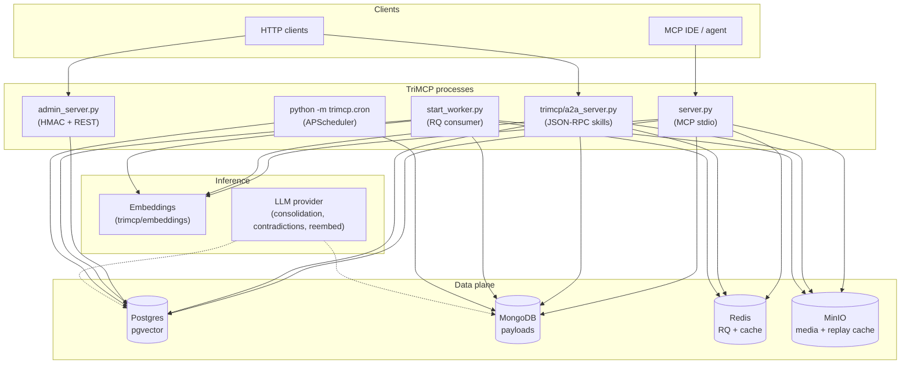
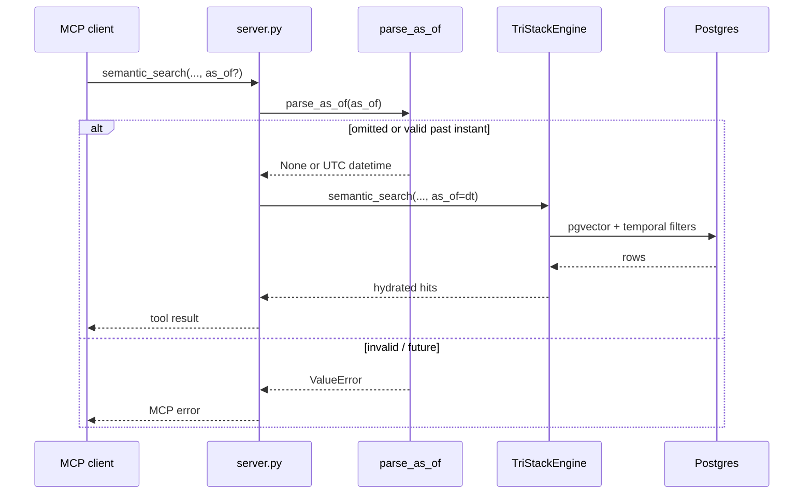
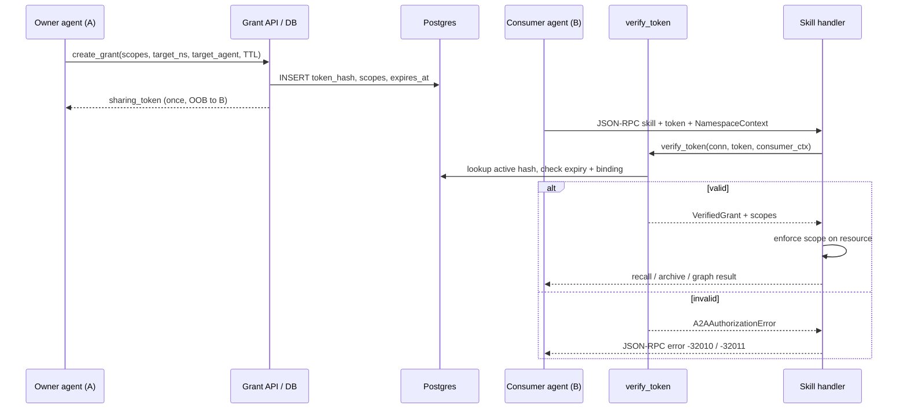

# TriMCP v1.0 — System architecture

This document is the **public, code-aligned** view of the TriMCP **v1.0** runtime: quad-database memory stack, **temporal** (time-travel) queries, **A2A** (agent-to-agent) sharing, and **cognitive / background** workers. It complements [architecture-phase-0-1-0-2.md](./architecture-phase-0-1-0-2.md) (namespaces, signing) and [deploy/README.md](../deploy/README.md) (Compose layout).

---

## 1. Runtime topology

Multiple OS processes cooperate: the **MCP server** (stdio), optional **A2A** and **admin** HTTP services, an **RQ worker** for async code indexing, and a **cron** scheduler for bridge renewal and batch re-embedding. All paths share the same **quad-DB** contracts (PostgreSQL + pgvector, MongoDB, Redis, MinIO).



---

## 2. Temporal engine (memory time-travel)

**Purpose:** Query **semantic** recall and **graph** structure *as they existed at or before* a client-supplied instant, without allowing future timestamps.

| Artifact | Role |
|----------|------|
| `trimcp/temporal.py` | `parse_as_of()` — ISO 8601 in, UTC-normalised `datetime` or `None`; rejects malformed input and future times. |
| `TriStackEngine.semantic_search(..., as_of=)` | Adds SQL predicates on `memories.created_at` (and optional namespace retention window from metadata). |
| `TriStackEngine.graph_search(..., as_of=)` | Restricts graph visibility to the same temporal cut. |
| MCP tools | `semantic_search` and `graph_search` expose optional `as_of` in `server.py`. |



---

## 3. A2A protocol (agent-to-agent memory)

**Purpose:** **Agent A** grants **scoped read** access to **Agent B** for namespaces, individual memories, KG nodes, or subgraphs, using an out-of-band sharing token. Tokens are stored only as **SHA-256 hashes** in `a2a_grants`.

| Artifact | Role |
|----------|------|
| `trimcp/a2a.py` | Grant creation, token verification, JSON-RPC error codes (-32010 / -32011 / -32012). |
| `trimcp/a2a_server.py` | Starlette app: agent card, JSON-RPC skill dispatch, `TriStackEngine` lifespan. |
| `trimcp/schema.sql` | `a2a_grants` table + indexes. |



Skills (non-exhaustive) are declared on the agent card in `a2a_server.py` and map to orchestrator methods (for example semantic + graph recall, session archive).

---

## 4. PII Redaction pipeline (Phase 0.3)

**Purpose:** Automatically detect and mask sensitive entities (names, emails, SSNs) before they are stored or processed by external LLMs.

| Artifact | Role |
|----------|------|
| `trimcp/pii.py` | Core pipeline: detection via **Microsoft Presidio** (primary) or **Regex** (fallback); policies: `redact`, `pseudonymise`, `reject`, `flag`. |
| `pii_redactions` | Reversible vault (PostgreSQL) storing encrypted original values (AES-256-GCM). |
| `unredact_memory` | Admin tool to temporarily restore PII context for authorized requests. |

---

## 5. Memory replay engine (Phase 2.3)

**Purpose:** Observational playback of events or active simulation into isolated **forked namespaces**.

| Artifact | Role |
|----------|------|
| `trimcp/replay.py` | `ForkedReplayEngine` — async generator based; supports `deterministic` (MinIO cache) and `re-execute` (fresh LLM) modes. |
| `replay_runs` | PostgreSQL table tracking replay progress and parent-child event causal links. |
| Causal signatures | Every replayed event is signed with a fresh HMAC-SHA256, providing **alternate causal provenance**. |

---

## 6. Cognitive and background workers

These components run **outside** the MCP hot path (batch / scheduled / optional LLM calls).

| Component | Entry | Function |
|-----------|--------|----------|
| **Re-embedding** | `trimcp/reembedding_worker.py`, invoked from `trimcp/cron.py` | Keyset-paginated sweep: refresh embeddings when the active model changes; optional Mongo text hydration; rate-limited batches; audit via `reembedding_runs`. |
| **Bridge renewal** | `trimcp/cron.py` → `trimcp/bridge_renewal.py` | Interval job: renew expiring document-bridge subscriptions (SharePoint / Drive / Dropbox). |
| **Orphan GC** | `trimcp/garbage_collector.py`, `run_gc_loop` from `server.py` startup | Safety net for Mongo payloads without matching Postgres references. |
| **Sleep consolidation** | `trimcp/consolidation.py` | `ConsolidationWorker` clusters episodic memories via configured **LLMProvider** and writes abstractions (validated Pydantic output); wire to your scheduler or ops workflow as needed. |
| **Contradictions** | `trimcp/contradictions.py` + MCP tools `list_contradictions` / `resolve_contradiction` | Detection and resolution workflow tied to namespace memory. |

```mermaid
flowchart LR
  subgraph Scheduler["trimcp.cron (APScheduler)"]
    J1[bridge_subscription_renewal]
    J2[phase_2_1_reembedding]
  end

  J1 --> BR[renew_expiring_subscriptions]
  BR --> PG1[(Postgres)]

  J2 --> RW[ReembeddingWorker.run_once]
  RW --> PG2[(Postgres)]
  RW --> MG[(MongoDB)]

  subgraph MCP_boot["MCP server lifecycle"]
    GC[run_gc_loop]
  end

  GC --> MG3[(MongoDB)]

### 6.1 RLS and background workers

**Design decision — Prompt 28 audit:**

Background workers operate with **system-level database privileges** that intentionally
bypass Postgres Row-Level Security (RLS).  This is a deliberate architectural choice, not
an oversight:

| Worker | RLS bypass reason |
|--------|-------------------|
| **Garbage Collector** (`garbage_collector.py`) | Scans *all* namespaces for orphaned Mongo payloads. Cross-namespace visibility is required — `WHERE payload_ref NOT IN (SELECT payload_ref FROM memories)` must see every row regardless of tenant. |
| **Re-embedding Worker** (`reembedding_worker.py`) | Keyset-paginates across all memories to refresh embeddings when the active model changes. A per-namespace WHERE would require N separate scans. RLS bypass avoids combinatorial overhead. |
| **RQ Code Indexing** (`tasks.py`) | Uses `scoped_session(namespace_id)` when a namespace is provided — RLS is enforced for tenant-scoped indexing. Falls back to raw `pg_pool.acquire()` for shared/enterprise indexing. |

**Mitigation:** System-level connections are only used by background workers that do not
serve user requests directly.  All user-facing paths (MCP tools, A2A, admin HTTP) go through
`scoped_session()` which sets `trimcp.namespace_id` via `SET LOCAL`.

**Future:** Add a dedicated `trimcp_background` Postgres role with CROSS-NAMESPACE READ
grant but no WRITE privilege on user-data tables. This would limit the blast radius of a
compromised background worker while preserving the necessary cross-tenant scan capability.

---

## 7. Vector index performance with RLS

**Prompt 28 audit — pgvector HNSW + RLS interaction:**

When Row-Level Security filters are combined with pgvector HNSW indexes, PostgreSQL
follows this execution path:

1. **Index scan**: The HNSW index on `memory_embeddings.embedding` performs the vector
   proximity search (`<=>` operator), producing candidate rows ordered by distance.
2. **Filter application**: RLS policies are applied as an additional filter on top of the
   index results, not inside the index itself. This means RLS does NOT prevent use of the
   HNSW index — the index still accelerates the distance computation.
3. **Potential inefficiency**: If RLS filters a large fraction of rows (e.g., a namespace
   with only 1% of total memories), the HNSW index may return many candidates that are
   subsequently discarded by RLS. The effective `LIMIT` after RLS filtering may be lower
   than the requested `top_k`.

**Recommendations:**

| Scenario | Action |
|----------|--------|
| Small namespaces (<10k vectors) | No action — HNSW overhead is negligible. |
| Large namespaces (>100k vectors, many tenants) | Increase `candidate_k` from `top_k * 4` to `top_k * 8` in `semantic_search()` and `search_codebase()`. |
| Extreme multi-tenancy (>1k tenants) | Consider partial indexes per hot namespace. |
| Monitoring | Track `SCOPED_SESSION_LATENCY` histogram (added Prompt 28). If median >2 ms, investigate pool sizing. |

**Current state:** HNSW indexes are defined in `schema.sql` on `memories.embedding` and
`memory_embeddings.embedding`. RLS policies are applied as `SELECT` filters post-index-scan.
The index is never bypassed — RLS filters candidates after the HNSW proximity search.

---

## 8. Database partitioning vs declarative referential integrity

**Design tradeoff — Partitioning on composite keys (`id, created_at`):**

To support high-throughput temporal operations and efficient time-based pruning, TriMCP leverages **PostgreSQL RANGE partitioning** on several high-volume tables (e.g., `memories` on `created_at`, `event_log` on `occurred_at`, `contradictions` on `detected_at`). 

PostgreSQL imposes a strict rule on partitioned tables: **any primary key or unique constraint must include all partition key columns**. 

### The Problem: Declarative FK Blockers

Because `memories` has the composite primary key `(id, created_at)` and `event_log` has `(id, occurred_at)`, child tables such as `memory_salience` or `pii_redactions` cannot declare standard SQL foreign key references on `id` alone:

```sql
-- This standard syntax fails in PostgreSQL:
ALTER TABLE memory_salience ADD CONSTRAINT fk_memory_salience_memory 
    FOREIGN KEY (memory_id) REFERENCES memories(id);
-- ERROR: there is no unique constraint matching given keys for referenced table "memories"
```

### Evaluated Architectural Options

| Option | Mechanics | Advantages | Disadvantages |
|--------|-----------|------------|---------------|
| **A. Global Lookup Table** | Create a non-partitioned, unique table `memory_ids(id UUID PRIMARY KEY)` populated via database triggers on the partitioned parent. Child tables declare FKs to `memory_ids`. | Restores declarative foreign keys on child tables; prevents orphaned records at the schema level. | Introduces lock contention, duplicate index overhead, and write-amplification via trigger overhead on hot ingestion paths. |
| **B. Hash Partitioning on ID** | Partition `memories` on `(id)` instead of RANGE on `(created_at)`. Allows `id` to be the sole PK and restores declarative FKs. | Native referential integrity; standard unconstrained foreign keys. | Completely destroys temporal performance. Range/time-travel queries (`created_at <= as_of`) must scan *all* partitions, eliminating partition pruning benefits. |
| **C. Standardized Trigger + GC Cascade Patterns** | Accept the lack of declarative FKs as a necessary performance tradeoff. Enforce integrity via (1) transaction safety (Saga/atomic commits), (2) database trigger validations where immediate enforcement is vital, and (3) optimized, scheduled background garbage collection. | **Selected & Approved Approach.** Zero ingestion overhead, maximum time-travel query pruning, highly performant bulk deletion. | Requires robust validation of the background GC engine (`garbage_collector.py`) and explicit application-layer consistency. |

### Implemented Mitigations

1. **Trigger-Based References (for `event_log` parent-child tracking)**:
   Since `event_log` partitions are append-only (WORM) but parent-child causal links (`parent_event_id`) must refer to valid events, a custom trigger `trg_event_log_parent_fk_insupd` performs a single-row verification lookup. Deletes trigger `trg_event_log_parent_fk_del` to nullify child references safely.
2. **Unified Cascading Garbage Collection**:
   The `garbage_collector.py` loops hourly (via the MCP background lifecycle) to sweep for orphan rows across unlinked tables. Rather than executing disjointed scans against `memories`, the GC compiles a single, unified cascading CTE (`_clean_orphaned_cascade()`) that identifies orphans across `memory_salience`, `contradictions`, `event_log`, and `kg_nodes` in a single pass, performing atomic cascading deletes with high performance.

---

## 9. MCP tool surface (v1.0)

The following tools are exposed via the Model Context Protocol (MCP) in `server.py`:

| Category | Tools | Description |
|----------|-------|-------------|
| **Ingestion** | `store_memory`, `store_media`, `index_code_file` | Primary write path; supports Saga consistency and PII redaction. |
| **Recall** | `semantic_search`, `graph_search`, `get_recent_context` | Primary read path; supports `as_of` temporal queries. |
| **Cognitive** | `list_contradictions`, `resolve_contradiction`, `boost_memory`, `forget_memory` | Salience management and factual integrity. |
| **Sim / Audit** | `replay_observe`, `replay_fork`, `verify_memory`, `compare_states` | Simulation, time travel, and integrity verification. |
| **A2A Sharing** | `a2a_create_grant`, `a2a_revoke_grant`, `a2a_list_grants`, `a2a_query_shared` | Cryptographic scoped sharing protocol. |
| **Admin** | `manage_namespace`, `manage_quotas`, `rotate_signing_key`, `get_health`, `trigger_consolidation` | Governance, security, and diagnostics. |

---

## 10. Related diagrams

| Topic | Document |
|-------|----------|
| Async `index_code_file` + RQ worker saga | [recursive_indexing_flow.md](./recursive_indexing_flow.md) |
| Namespaces, signing, Phase 0 data model | [architecture-phase-0-1-0-2.md](./architecture-phase-0-1-0-2.md) |
| Push / webhooks | [push_architecture.md](./push_architecture.md) |
| Compose services | [deploy/README.md](../deploy/README.md) |
