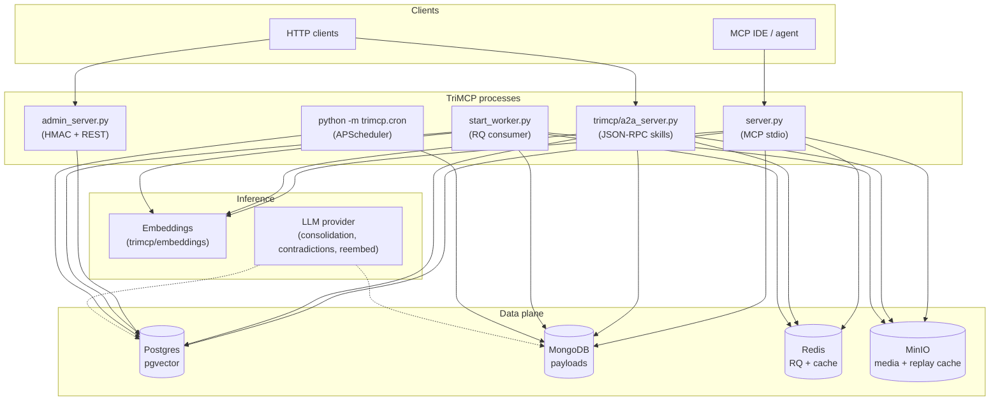
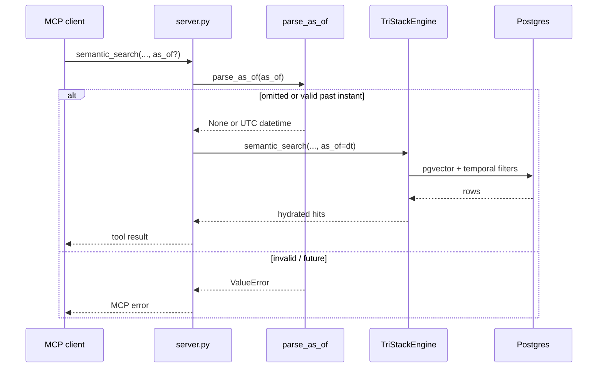
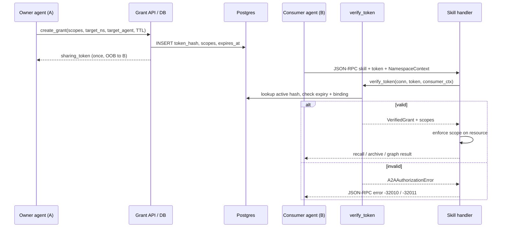
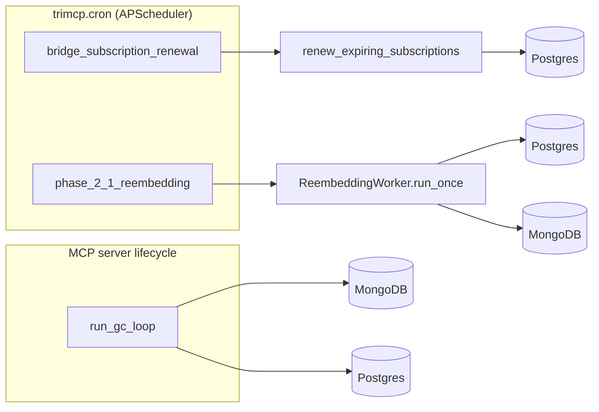

# TriMCP v1.0 — System architecture

This document is the **public, code-aligned** view of the TriMCP **v1.0** runtime: quad-database memory stack, **temporal** (time-travel) queries, **A2A** (agent-to-agent) sharing, and **cognitive / background** workers. It complements [architecture-phase-0-1-0-2.md](./architecture-phase-0-1-0-2.md) (namespaces, signing) and [deploy/README.md](../deploy/README.md) (Compose layout).

---

## 1. Runtime topology

Multiple OS processes cooperate: the **MCP server** (stdio), optional **A2A** and **admin** HTTP services, an **RQ worker** for async code indexing, and a **cron** scheduler for bridge renewal and batch re-embedding. All paths share the same **quad-DB** contracts (PostgreSQL + pgvector, MongoDB, Redis, MinIO).

---

## 2. Temporal engine (memory time-travel)

**Purpose:** Query **semantic** recall and **graph** structure *as they existed at or before* a client-supplied instant, without allowing future timestamps.

| Artifact | Role |
|----------|------|
| `trimcp/temporal.py` | `parse_as_of()` — ISO 8601 in, UTC-normalised `datetime` or `None`; rejects malformed input and future times. |
| `TriStackEngine.semantic_search(..., as_of=)` | Adds SQL predicates on `memories.created_at` (and optional namespace retention window from metadata). |
| `TriStackEngine.graph_search(..., as_of=)` | Restricts graph visibility to the same temporal cut. |
| MCP tools | `semantic_search` and `graph_search` expose optional `as_of` in `server.py`. |

---

## 3. A2A protocol (agent-to-agent memory)

**Purpose:** **Agent A** grants **scoped read** access to **Agent B** for namespaces, individual memories, KG nodes, or subgraphs, using an out-of-band sharing token. Tokens are stored only as **SHA-256 hashes** in `a2a_grants`.

| Artifact | Role |
|----------|------|
| `trimcp/a2a.py` | Grant creation, token verification, JSON-RPC error codes (-32010 / -32011 / -32012). |
| `trimcp/a2a_server.py` | Starlette app: agent card, JSON-RPC skill dispatch, `TriStackEngine` lifespan. |
| `trimcp/schema.sql` | `a2a_grants` table + indexes. |

Skills (non-exhaustive) are declared on the agent card in `a2a_server.py` and map to orchestrator methods (for example semantic + graph recall, session archive).

---

## 4. Cognitive and background workers

These components run **outside** the MCP hot path (batch / scheduled / optional LLM calls).

| Component | Entry | Function |
|-----------|--------|----------|
| **Re-embedding** | `trimcp/reembedding_worker.py`, invoked from `trimcp/cron.py` | Keyset-paginated sweep: refresh embeddings when the active model changes; optional Mongo text hydration; rate-limited batches; audit via `reembedding_runs`. |
| **Bridge renewal** | `trimcp/cron.py` → `trimcp/bridge_renewal.py` | Interval job: renew expiring document-bridge subscriptions (SharePoint / Drive / Dropbox). |
| **Orphan GC** | `trimcp/garbage_collector.py`, `run_gc_loop` from `server.py` startup | Safety net for Mongo payloads without matching Postgres references. |
| **Sleep consolidation** | `trimcp/consolidation.py` | `ConsolidationWorker` clusters episodic memories via configured **LLMProvider** and writes abstractions (validated Pydantic output); wire to your scheduler or ops workflow as needed. |
| **Contradictions** | `trimcp/contradictions.py` + MCP tools `list_contradictions` / `resolve_contradiction` | Detection and resolution workflow tied to namespace memory. |

---

## 5. Related diagrams

| Topic | Document |
|-------|----------|
| Async `index_code_file` + RQ worker saga | [recursive_indexing_flow.md](./recursive_indexing_flow.md) |
| Namespaces, signing, Phase 0 data model | [architecture-phase-0-1-0-2.md](./architecture-phase-0-1-0-2.md) |
| Push / webhooks | [push_architecture.md](./push_architecture.md) |
| Compose services | [deploy/README.md](../deploy/README.md) |
