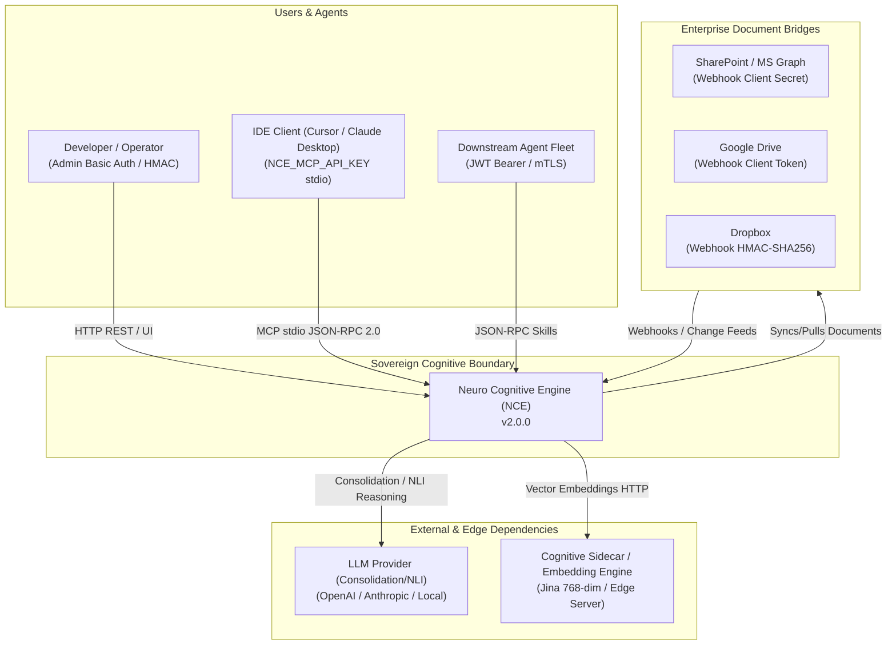
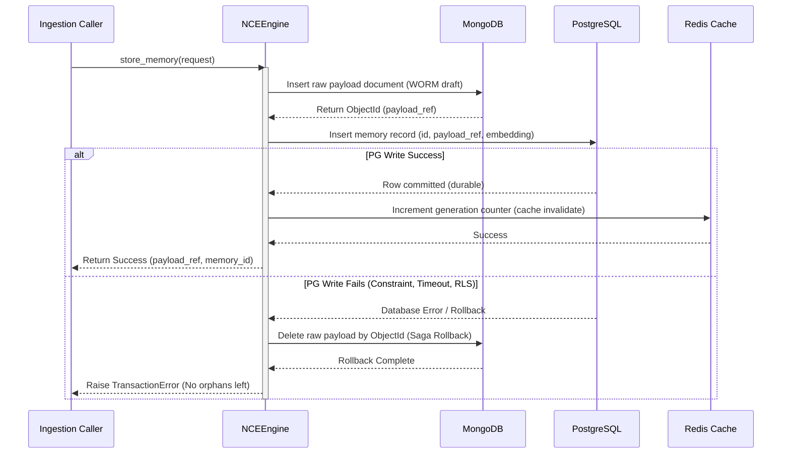
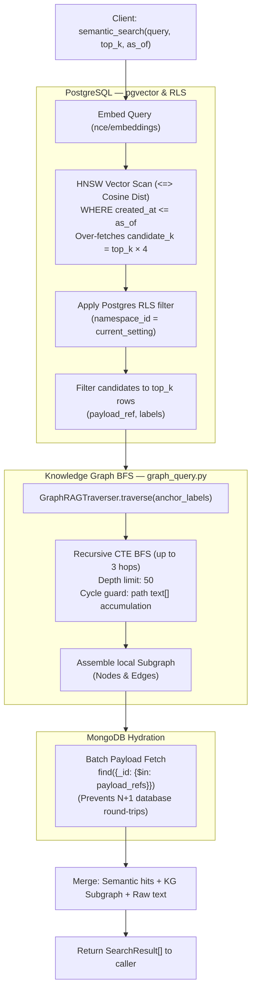

# NCE v2.0.0 — System Architecture & C4 Context

This document provides a comprehensive, code-aligned specification of the **Neuro Cognitive Engine (NCE) version 2.0.0** runtime architecture. It details the C4 System Context and Container structures, the primary processes and entry points, the Quad-Database stack, the transactional Saga pattern, the GraphRAG query hydration pipeline, and background asynchronous/scheduled tasks.

---

## 1. C4 Architecture Specification

### 1.1 Level 1: System Context Diagram
The System Context Diagram shows how users, IDEs, and other agent systems interface with the NCE, and how NCE depends on downstream LLM/embedding platforms and external file/document sources.



---

### 1.2 Level 2: Container Diagram
The Container Diagram illustrates NCE's primary runtime processes, entry points, background execution lanes, and the Quad-Database stack managed by `NCEEngine` (formerly known as `TriStackEngine`).

```mermaid
flowchart TB
  subgraph Clients["Inbound Interfaces"]
    IDE_Client["IDE Client (Cursor / Claude)"]
    Admin_Client["Operator Dashboard / Browser"]
    A2A_Client["External Agent Callers"]
    Web_Hook["Bridge Webhook Publishers"]
  end

  subgraph Containers["NCE Processes"]
    MCP["server.py\nMCP Server (stdio)"]
    Admin["admin_server.py\nHTTP Admin (Basic/HMAC)"]
    A2A["nce/a2a_server.py\nJSON-RPC (mTLS/JWT)"]
    Webhook["nce/webhook_receiver/main.py\nFastAPI Webhook Receiver\n(Sliding Window Rate Limiter)"]
    Worker["start_worker.py\nRQ Async Worker\n(Default/High/Batch lanes)"]
    Cron["nce/cron.py\nAPScheduler Cron Engine\n(Distributed CronLock)"]
  end

  subgraph Orchestrator["Unified Persistence Layer"]
    Engine["NCEEngine\n(Saga transaction rollback)\n(nce/orchestrator.py)"]
  end

  subgraph Datastores["Quad-Database Stack"]
    PG[("PostgreSQL + pgvector\n(Metadata, Graph, RLS session setting,\nRange partitioning)")]
    Mongo[("MongoDB\n(Raw Episodic & Code Archive\nWORM layout)")]
    Redis[("Redis\n(Job Queue, Locks, TTL Cache)")]
    MinIO[("MinIO S3-Compatible\n(Media, Replay Payload Cache)")]
  end

  IDE_Client -->|stdio JSON-RPC| MCP
  Admin_Client -->|HTTP REST (:8003)| Admin
  A2A_Client -->|HTTP JSON-RPC (:8004)| A2A
  Web_Hook -->|HTTP Webhooks (:8080)| Webhook

  MCP -->|Orchestrates| Engine
  Admin -->|Orchestrates| Engine
  A2A -->|Orchestrates| Engine
  Webhook -->|Rate Limits & Enqueues| Redis
  Worker -->|Processes Jobs| Engine
  Cron -->|Schedules Sagas & Outbox| Engine

  Engine -->|Queries & RLS| PG
  Engine -->|Saves Raw Payloads| Mongo
  Engine -->|Locks / Caching| Redis
  Engine -->|Saves Objects| MinIO

  Worker -->|Subscribes to lanes| Redis
  Cron -->|Orchestrates locks| Redis
```

---

## 2. Primary Entry Points

NCE version 2.0.0 exposes six distinct entry points, isolating workloads across dedicated runtimes:

### 2.1 `server.py` — MCP stdio Server
- **Role**: Entry point for IDE integration (Cursor, Claude Desktop). Envelopes the core cognitive engine in the Model Context Protocol (MCP) using the stdio transport.
- **Protocol**: JSON-RPC 2.0 over standard input/output.
- **Authentication**: `mcp_api_key` matching `NCE_MCP_API_KEY`.
- **Lifecycle**: Initiated when the IDE launches the agent. A garbage collector background loop is co-launched in the process as a co-routine on engine initialization.

### 2.2 `admin_server.py` — Admin UI & REST API
- **Role**: Web administration dashboard and REST endpoints for operations management.
- **Protocol**: HTTP/HTTPS (Port 8003).
- **Authentication**: HTTP Basic Auth (for the web UI) and HMAC-SHA256 API verification with Redis-backed nonce replay protection.
- **Operations**: Namespace management, quota modification, DLQ inspecting/replaying, signing key rotation, and diagnostic health checks.

### 2.3 `start_worker.py` — RQ Background Worker
- **Role**: Background task consumer driving expensive, asynchronous operations.
- **Protocol**: Redis queue polling.
- **Lanes & Priority Scopes**:
  - `high_priority`: Fast, user-facing operations (e.g. real-time document indexing, PII scrubbing verification).
  - `batch_processing`: Heavy, non-interactive sweeps (e.g. database re-embedding migrations).
  - `default`: Backward-compatibility fallback.

### 2.4 `nce/a2a_server.py` — A2A Skills Server
- **Role**: Starlette-based ASGI application exposing the public Agent-to-Agent (A2A) network bridge.
- **Protocol**: HTTP/HTTPS JSON-RPC 2.0 (Port 8004).
- **Authentication**: Optional mTLS certificate pinning combined with HS256/RS256 JWT validation.
- **Exposed Skills**: `recall_relevant_context`, `archive_session`, `find_related_decisions`, `verify_memory_integrity`, and `get_cognitive_state`.

### 2.5 `nce/cron.py` — APScheduler Cron Engine
- **Role**: Master cron daemon scheduling administrative tasks. Only a single instance should be active per cluster.
- **Locking**: Distributed locking backed by Redis (`CronLock` via `nce/cron_lock.py`) prevents race conditions when scaling horizontally.
- **Startup Jitter**: Applies a randomized startup delay (`CRON_STARTUP_JITTER_MAX_SECONDS`) to prevent thundering-herd database load spikes.

### 2.6 `nce/webhook_receiver/main.py` — Webhook Receiver
- **Role**: FastAPI-based listener endpoint receiving third-party document and CRM notifications.
- **Protocol**: HTTP/HTTPS (Port 8080).
- **Security**: Validates signatures (SharePoint client secret, Google client token, Dropbox HMAC-SHA256, and Dynamics 365 `x-ms-signaturecontent` HMAC-SHA256). Webhooks decode events and enqueue corresponding sync jobs in Redis to be processed by the RQ worker. Dynamics 365 events are routed to the `high_priority` lane to ensure low latency.

---

## 3. Quad-Stack & Saga Transaction Engine

`NCEEngine` (defined in `nce/orchestrator.py`) serves as the central orchestration controller, unifying the four datastores:

```
┌─────────────────────────────────────────────────────────────────┐
│                           NCEEngine                             │
│ ┌────────────────┐ ┌────────────────┐ ┌───────────┐ ┌─────────┐ │
│ │   PostgreSQL   │ │    MongoDB     │ │   Redis   │ │  MinIO  │ │
│ │ (asyncpg pool) │ │ (Motor client) │ │  (async)  │ │ (S3 SDK)│ │
│ └────────────────┘ └────────────────┘ └───────────┘ └─────────┘ │
└─────────────────────────────────────────────────────────────────┘
```

### 3.1 Distributed Transaction Safety (Saga Pattern)
Ingestion tasks (e.g. `store_memory`) must guarantee transactional integrity across NoSQL, SQL, and Cache boundaries. If the SQL constraint checks fail (e.g. RLS checks, format boundaries, or pool timeout), MongoDB changes must be rolled back.



### 3.2 Datastore Roles and Schema Configurations
- **PostgreSQL**: Implements RANGE partitioning on temporal columns (e.g. `memories` on `created_at`, `event_log` on `created_at`). Row-Level Security (RLS) is strictly enforced for multi-tenancy. Vector similarity search is enabled using the HNSW index on `memories.embedding` with the cosine operator (`<=>`).
- **MongoDB**: Stores heavy payloads (unstructured conversation text, code documents, media metadata) indexable via `payload_ref` pointers.
- **Redis**: Houses the RQ task queues, serves as a distributed locking provider for cron routines, and hosts high-speed TTL-limited caches (`semantic_search` result caches invalidated when a namespace writing operation increments the namespace's write-generation counter).
- **MinIO**: Acts as the object store hosting raw file artifacts (audio, video, images) under corresponding scopes (`nce-memories`, `nce-media`, `nce-replay-cache`).

---

## 4. GraphRAG Hydration Pipeline

NCE's retrieval engine combines vector space proximity searching, security gating, and Knowledge Graph (KG) relation walking to assemble multi-dimensional context.



---

## 5. Background Worker & Cron Tasks

Background systems operate outside the MCP stdio path to maintain data purity, renew subscriptions, and trigger cognitive updates:

### 5.1 RQ Workflows
The `start_worker.py` daemon processes operations enqueued by entry points:
- **Asynchronous Code Indexing**: The `index_code_file` tool accepts files, parses their structure asynchronously via the `tree-sitter` AST parser (generating separate code chunks for classes and functions), extracts relationships, and publishes vectors. Workloads run on `high_priority` to avoid delays from batch processes.
- **Document Bridge Processing**: File change events from the webhook receiver are converted to sync jobs, pulling raw content from Google Drive, SharePoint, or Dropbox and piping them into the ingestion engine.
- **Dynamics 365 Webhook & Ingestion Processing**: Webhooks from Microsoft Dynamics 365 trigger real-time updates enqueued directly to the `high_priority` queue lane via `process_d365_event` to process CRM events (e.g., annotations, case notes, emails, case updates) immediately. High-priority updates are prioritized to minimize response times, while structural changes prompt targeted GraphRAG relationship updates.

### 5.2 Scheduled Cron Tasks (APScheduler)
The `nce/cron.py` process drives the following scheduled operations:

| Task Name | Schedule | Lock / TTL | Purpose |
| :--- | :--- | :--- | :--- |
| `bridge_subscription_renewal` | Every $N$ minutes (env config) | `bridge_subscription_renewal` lock (TTL: $N$m $+ 60$s) | Renew expiring document-bridge subscriptions (OAuth client refreshes). |
| `phase_2_1_reembedding` | Every $M$ minutes (env config) | Running task constraints (no overlap) | Sweep PostgreSQL and MongoDB to update embeddings when the active model configuration changes. |
| `sleep_consolidation` | Every $C$ minutes (env config) | `sleep_consolidation` lock (TTL: $C$m $+ 60$s) | Scan namespaces with consolidation enabled, cluster episodic memories via HDBSCAN, and write abstract consolidated records. |
| `event_log_maintenance` | Monthly (1st at 00:00 UTC) | `event_log_partition_maintenance` lock (TTL: 3600s) | Automatically execute dynamic schema routines ensuring future monthly event_log partitions exist. |
| `saga_recovery` | Every 5 minutes | `saga_recovery` lock (TTL: 600s) | Sweep and finalize sagas stuck in `pg_committed` state (e.g. due to crashes between Postgres commits and Mongo callback completions). |
| `outbox_relay` | Every $S$ seconds (env config) | `outbox_relay` lock (TTL: $2 \times S$s) | Poll and forward outbound notification events to external webhook targets. |
| `d365_entity_sync` | Every $D$ minutes (env config) | `d365_entity_sync` lock (TTL: $D$m $+ 60$s) | Trigger full entity synchronization cycles against Dynamics 365 / Dataverse instances for active integration profiles. |

### 5.3 Co-Launched Garbage Collector Loop
- **Context**: The Garbage Collector (`nce/garbage_collector.py`) runs as a background co-routine co-launched directly by `server.py` on MCP startup.
- **Operation**: Periodically executes an hourly sweep. It identifies and removes orphaned MongoDB payloads that lack active PostgreSQL metadata records.
- **Integrity**: Runs with system-level privileges bypassing Postgres RLS to execute a fleet-wide scan efficiently in a single cascading CTE (`_clean_orphaned_cascade`).
