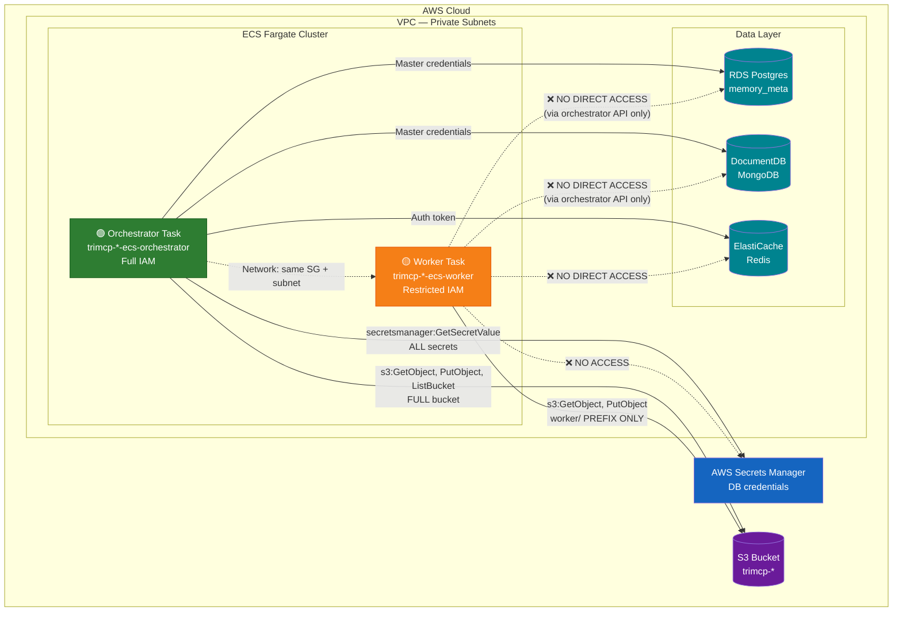

# TriMCP AWS IAM & Network Boundaries — Fargate Worker Isolation

**Date:** 2026-05-08  
**Status:** Implemented  
**Phase:** 2 — Infrastructure Hardening

---

## Overview

The Fargate worker pool previously shared a single IAM task role with full S3 bucket access and all database secrets. A compromised MCP integration executing on a worker would have gained the same privileges as the control plane. This hardening splits the IAM roles into two distinct trust boundaries:

| Role | Purpose | Privilege Level |
|------|---------|-----------------|
| `trimcp-*-ecs-orchestrator` | Control plane / task orchestration | Full data-plane access |
| `trimcp-*-ecs-worker` | Untrusted MCP integration execution | Scoped, minimal access |

---

## Architecture Diagram



---

## IAM Policy Details

### Orchestrator Role (`trimcp-*-ecs-orchestrator`)

```json
{
  "Statement": [
    {
      "Sid": "ReadAllSecrets",
      "Effect": "Allow",
      "Action": "secretsmanager:GetSecretValue",
      "Resource": [
        "arn:aws:secretsmanager:*:*:secret:trimcp-*-rds-*",
        "arn:aws:secretsmanager:*:*:secret:trimcp-*-docdb-*",
        "arn:aws:secretsmanager:*:*:secret:trimcp-*-redis-*"
      ]
    },
    {
      "Sid": "S3FullAccess",
      "Effect": "Allow",
      "Action": ["s3:GetObject", "s3:PutObject", "s3:ListBucket"],
      "Resource": [
        "arn:aws:s3:::trimcp-*-blobs",
        "arn:aws:s3:::trimcp-*-blobs/*"
      ]
    }
  ]
}
```

### Worker Role (`trimcp-*-ecs-worker`)

```json
{
  "Statement": [
    {
      "Sid": "S3WorkerPrefix",
      "Effect": "Allow",
      "Action": ["s3:GetObject", "s3:PutObject"],
      "Resource": ["arn:aws:s3:::trimcp-*-blobs/worker/*"]
    },
    {
      "Sid": "S3ListBucket",
      "Effect": "Allow",
      "Action": ["s3:ListBucket"],
      "Resource": ["arn:aws:s3:::trimcp-*-blobs"],
      "Condition": {
        "StringLike": {
          "s3:prefix": ["worker/*"]
        }
      }
    }
  ]
}
```

### Execution Role (shared — both tasks)

- `AmazonECSTaskExecutionRolePolicy` (managed): ECR pull, CloudWatch Logs write

---

## Blast Radius Analysis

| Scenario | Before (shared role) | After (isolated roles) |
|----------|---------------------|----------------------|
| **Compromised MCP integration** | Attacker reads ALL DB secrets, R/W entire S3 bucket | Attacker accesses only `worker/*` S3 prefix, zero DB secrets |
| **Orchestrator compromise** | Same as above (identical blast radius) | Attacker gets full data-plane (unchanged — orchestrator needs it) |
| **Credential leak via env vars** | All DB credentials exposed | Workers have no DB credentials in env |
| **Lateral movement** | Worker → RDS/DocDB/Redis direct | Worker → orchestrator API (authenticated, audited) → DB |

---

## Deployment Notes

1. **Worker secrets** (`worker_secrets_arns`) defaults to `[]`. If workers need a scoped DocumentDB user, create a dedicated secret with read-only or collection-scoped credentials and add its ARN to this list.
2. **S3 prefix** (`worker_s3_prefix`) defaults to `"worker/"`. Workers can only read/write objects under this prefix. The `ListBucket` permission is conditioned on the same prefix.
3. **Same cluster, different roles** — both services run on the same ECS cluster and share the same security group and subnets. The isolation is purely at the IAM boundary.

---

## Related

- `trimcp-infra/aws/modules/fargate-worker/main.tf` — Module implementation
- `trimcp-infra/aws/modules/fargate-worker/variables.tf` — Variable definitions
- `trimcp-infra/aws/main.tf` — Root module call with split configuration
- `to-do-v1-phase2.md` — Kaizen entry for this hardening
