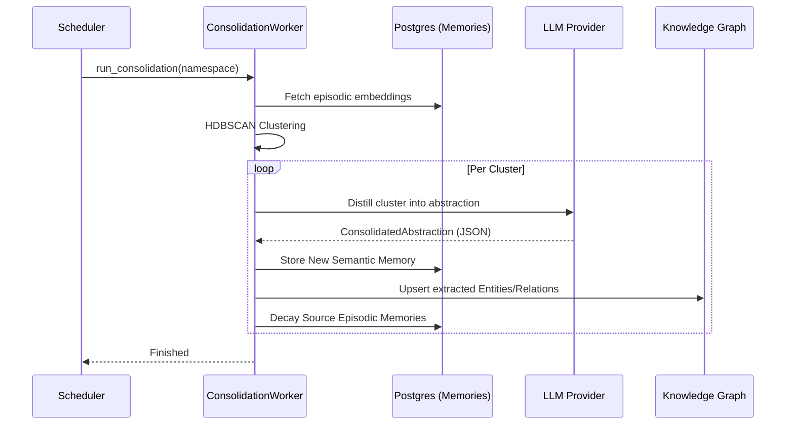

# Cognitive Layer: Consolidation and Salience

The Cognitive Layer is the "brain" of TriMCP, transforming raw episodic events into structured semantic knowledge and managing the lifecycle of information based on its relevance and age.

## 1. Memory Consolidation (The Sleep Cycle)

As an agent accumulates episodic memories, the `ConsolidationWorker` periodically runs to identify patterns and distill them into "Semantic Abstractions."

### Consolidation Signal Flow

### Key Technologies
-   **HDBSCAN**: Used for density-based clustering of memory embeddings. It identifies related groups of memories without requiring a pre-defined number of clusters.
-   **Pydantic V2**: All LLM outputs are strictly validated against a schema before being stored, ensuring data integrity in the Knowledge Graph.

## 2. Salience and The Forgetting Curve

TriMCP uses the **Ebbinghaus Forgetting Curve** to model how the importance of a memory decays over time.

### Salience Score ($s$)
The salience of a memory is a value between `0.0` and `1.0`. It decays exponentially:
$$s(t) = s_{last} \cdot e^{-\lambda \cdot \Delta t}$$
Where $\lambda$ is the decay constant based on the configured half-life.

### Reinforcement
Every time a memory is retrieved or mentioned, its salience is **reinforced**:
$$s_{new} = \min(1.0, s_{current} + \delta)$$
This "resets" the forgetting curve, keeping frequently accessed information at the forefront of the agent's context.

## 3. Contradiction Detection

TriMCP automatically flags logical conflicts when new factual information contradicts existing knowledge.

### Detection Path
1.  **Semantic Match**: Find similar existing memories using vector search.
2.  **KG Conflict**: Check the Knowledge Graph for conflicting relations (e.g., `Alice works at Apple` vs `Alice works at Google`).
3.  **NLI Engine**: Uses a **Cross-Encoder (nli-deberta-v3-small)** to perform high-precision natural language inference (entailment vs contradiction) between the new memory and candidates.
4.  **LLM Verification**: If the NLI score is ambiguous, a specialized "Contradiction Auditor" prompt is used as a final tiebreaker.

Unresolved contradictions are logged in the `contradictions` table and can be surfaced via the `list_contradictions` MCP tool for the agent to resolve.
