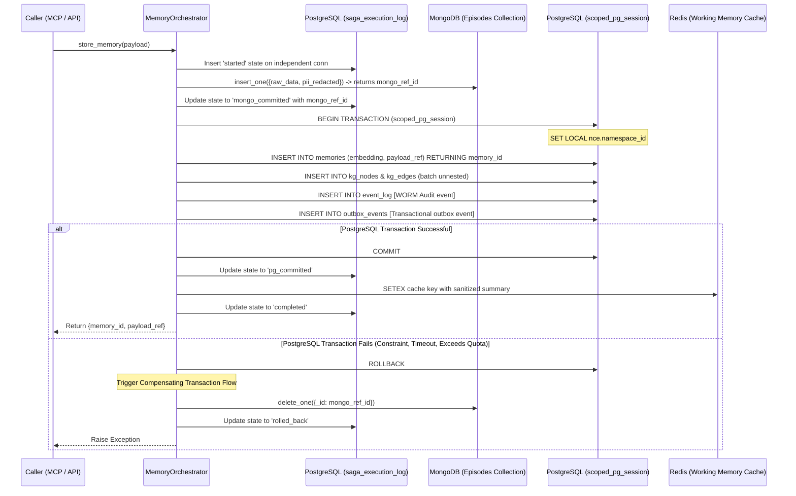
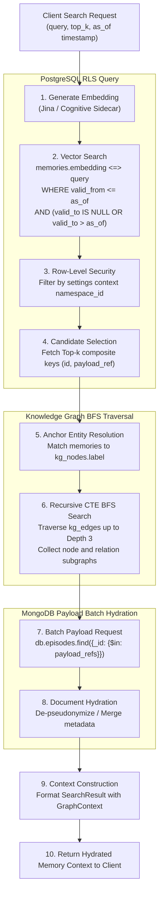

# NCE Database Architecture

Deep-dive into the Neuro Cognitive Engine (NCE) data persistence layer: the Quad-Database stack, connection pool sizing, transaction boundaries, Row-Level Security (RLS) context initialization, the Saga pattern implementation, Saga crash-recovery logging, the GraphRAG hydration pipeline, partition strategies, and the complete PostgreSQL schema definition.

---

## 1. Quad-Database Role Assignment

To meet enterprise requirements for performance, scalability, and strict temporal isolation, NCE distributes its data across four distinct databases, each matched to the specific storage model for which it is optimized:

| Storage Layer | Database | Access Library | Primary Role | Data Lifecycle & Retention |
| :--- | :--- | :--- | :--- | :--- |
| **Semantic Index** | PostgreSQL (with `pgvector` & `pg_trgm`) | `asyncpg` (async pool) | Enforces the relational schema, vector embeddings (768-dim), Knowledge Graph (KG) triplets, Row-Level Security (RLS), and the append-only (WORM) event log. | Long-term persistent storage; partitioned monthly or via hash. |
| **Episodic Archive** | MongoDB | `motor` (async driver) | Stores heavy unstructured raw payloads (full conversation transcripts, raw document pages, bulk code file contents, and media metadata). | Persistent archive; referenced via hex-encoded 24-character ObjectIDs. |
| **Working Memory & Queues** | Redis | `redis.asyncio` (async) & `redis` (sync for RQ) | Handles short-term context cache, distributed locks, rate-limiting, HMAC nonces, active token checks, and background worker queues (RQ). | Transient; TTL-evicted (default 3600s) or job-completed pruned. |
| **Object Store** | MinIO (S3 compatible) | `minio` (thread-pooled via `asyncio.to_thread`) | Archival storage of large media objects (audio recordings, images, video segments) and LLM response caches for deterministic replay. | Persistent bucket storage with path indexing. |

Global database connections are initialized and managed by the `TriStackEngine` class within `nce/orchestrator.py` during application boot.

---

## 2. Connection Pools & Resource Control

### 2a. PostgreSQL Connection Pooling
NCE utilizes a high-performance, non-blocking connection pool via `asyncpg` configured in `nce/orchestrator.py`:

```python
self.pg_pool = await asyncpg.create_pool(
    cfg.PG_DSN,
    min_size=cfg.PG_MIN_POOL,    # Default: 1
    max_size=cfg.PG_MAX_POOL,    # Default: 10
    command_timeout=30.0,        # Hard statement timeout in seconds
)
```

* **Read Replicas**: If `DB_READ_URL` is configured differently from `PG_DSN`, NCE instantiates an independent `pg_read_pool` dedicated to handling read-only queries (e.g. `semantic_search` and `graph_search` traversals).
* **Checkout Timeouts**: Connections acquired from the pool are strictly bound by a checkout timeout constant `POOL_ACQUIRE_TIMEOUT = 10.0` seconds defined in `nce/db_utils.py`. This ensures that pool exhaustion raises a catchable timeout error rather than stalling the ASGI event loop:
  ```python
  async with pool.acquire(timeout=POOL_ACQUIRE_TIMEOUT) as conn:
      # Perform database operations
  ```

### 2b. MongoDB Connection Pooling
MongoDB access is coordinated by the `AsyncIOMotorClient` pool:

```python
self.mongo_client = AsyncIOMotorClient(
    cfg.MONGO_URI,
    serverSelectionTimeoutMS=5000,
    maxPoolSize=cfg.MONGO_MAX_POOL,  # Default: 100
)
```

* **Indexes**: At boot time, `TriStackEngine._init_mongo_indexes()` ensures unique indexes exist on `_id` and the `namespace_id` key to guarantee lookup performance of raw documents.

### 2c. Redis Connection Pooling
Redis uses a dual-client model to accommodate asynchronous web request routing and synchronous worker queue orchestration:

```python
# Async client for cache, rate-limits, and session management
self.redis_client = redis.from_url(
    cfg.REDIS_URL,
    socket_connect_timeout=5,
    socket_timeout=5,
    max_connections=cfg.REDIS_MAX_CONNECTIONS,  # Default: 20
    health_check_interval=30,
)

# Synchronous client for the RQ background worker queue thread pool
self.redis_sync_client = redis_sync.from_url(
    cfg.REDIS_URL,
    socket_connect_timeout=5,
    socket_timeout=5,
)
```

---

## 3. Transaction Boundaries & Row-Level Security (RLS)

All tenant-specific PostgreSQL operations must execute inside a transaction-scoped RLS context using the `scoped_pg_session` context manager.

### 3a. The scoped_pg_session Pattern
The `scoped_pg_session` manager guarantees that every checkout enforces the active namespace ID.

```python
# nce/db_utils.py
from contextlib import asynccontextmanager

@asynccontextmanager
async def scoped_pg_session(pool: asyncpg.Pool, namespace_id: str):
    async with pool.acquire(timeout=POOL_ACQUIRE_TIMEOUT) as conn:
        async with conn.transaction():
            # Set the transaction-scoped session variable
            await conn.execute(
                "SET LOCAL nce.namespace_id = $1", 
                str(namespace_id)
            )
            try:
                yield conn
            finally:
                # Local variables automatically reset on COMMIT/ROLLBACK,
                # but we explicitly clear to ensure safety in all conditions
                await conn.execute("RESET nce.namespace_id")
```

### 3b. Why RLS Context Requires SET LOCAL
Using `SET LOCAL` scopes the configuration setting to the immediate transaction block. If the connection is returned to the pool, the setting is guaranteed to revert, preventing cross-tenant leakage. 

* **Admin Bypass**: A narrow set of global maintenance paths (schema migrations, partition maintenance, cron namespace scans) check out connections via `unmanaged_pg_connection(pool)`, which skips `SET LOCAL nce.namespace_id`. Today these still authenticate as the application role (`nce_app`) — `unmanaged_pg_connection` is the app role *skipping* RLS scoping on audited global sites, not a separate database principal.
* **Worker principal segregation (`nce_gc`)**: The `nce_gc` role exists in `schema.sql` with the `BYPASSRLS` attribute for least-privilege worker isolation. Background maintenance **workers** (the garbage collector and the re-embedding worker) resolve their connection DSN via `db_utils.resolve_worker_dsn()`, which returns `NCE_GC_DSN` when set (so the worker connects as `nce_gc` with its own credentials) and otherwise falls back to `PG_DSN` (the app role) for backward compatibility. To activate segregation, provision `nce_gc` with `LOGIN` + its own password and point `NCE_GC_DSN` at it; the application pool then never authenticates as a `BYPASSRLS` role. Note the GC itself runs RLS-scoped per namespace (it calls `set_namespace_context` rather than relying on `BYPASSRLS`), so segregation is primarily a credential-isolation boundary.

---

## 4. The Saga Pattern — Distributed Multi-Database Write Path

Because writing memory requires updating MongoDB (episodic archive), PostgreSQL (semantic index and graph relations), and Redis (active cache), NCE implements a Saga Pattern orchestrator to ensure eventual consistency. 

### 4a. Write Path Sequence Diagram



### 4b. Compensating Transactions & Rollback Details
If the PostgreSQL transaction aborts, the compensating transaction executes the following steps:
1. **Episodic Deletion**: The MongoDB document associated with the generated `mongo_ref_id` is purged via `delete_one`.
2. **Postgres Integrity Enforcement**: In the rare event that the Postgres transaction was marked committed but downstream steps failed (such as logging transitions), a cleanup connection is opened to execute:
   * `DELETE FROM memory_embeddings WHERE memory_id = $1`
   * `DELETE FROM pii_redactions WHERE memory_id = $1`
   * `DELETE FROM kg_edges WHERE payload_ref = $1`
   * `DELETE FROM kg_nodes WHERE payload_ref = $1`
   * `UPDATE memories SET valid_to = NOW() WHERE id = $1` (Soft-retire fallback)
3. **Saga State Logging**: The saga record in `saga_execution_log` is transitioned to `'rolled_back'`.

### 4c. Crash-Recovery & The Garbage Collection Backstop
* **Durable Saga Log**: If an NCE worker process crashes mid-saga, the `saga_execution_log` remains in `'started'` or `'pg_committed'` states. An hourly cron job queries the log for unfinished sagas older than 10 minutes and triggers the appropriate compensation workflow.
* **Orphan Garbage Collector**: An independent, keyset-paginated background garbage collector running under the bypass-RLS `nce_gc` role scans the MongoDB database. Any document in MongoDB that has no matching foreign key reference (`payload_ref`) in the PostgreSQL `memories` table, and is older than `GC_ORPHAN_AGE_SECONDS` (default: 3600), is purged.

---

## 5. GraphRAG Hydration Pipeline

Retrieving semantic memory involves an integrated search across the vector index, relation extraction on the knowledge graph, and payload enrichment from MongoDB:



### 5a. Performance & Safety Guards
* **Recursion Depth Cap**: The Recursive CTE in `nce/graph_query.py` enforces a maximum recursion depth check (`depth < 50`) and tracks visited nodes (`path text[]`) to prevent cyclic graphs from triggering infinite loops.
* **N+1 Query Elimination**: Payloads are resolved in a single batch query (`$in: [ObjectIds]`) against MongoDB rather than performing individual queries for each memory retrieved.

---

## 6. Partitioning Strategies

NCE uses partitioned tables for tables with high write volume to maintain query performance over time.

### 6a. Range Partitioning (Monthly)
Tables partitioned by time range (`RANGE`) route writes to monthly partitions.
* **Partitioned Tables**:
  * `memories` (partitioned on `created_at`)
  * `event_log` (partitioned on `occurred_at`)
  * `contradictions` (partitioned on `detected_at`)
  * `pii_redactions` (partitioned on `created_at`)
* **Partition Maintenance**: At boot time, `nce_ensure_event_log_monthly_partitions(p_months_ahead)` executes a PL/pgSQL function to ensure partitions exist for the current month and up to 3 months in advance.
* **Foreign Key Constraints Constraint**: PostgreSQL does not allow referencing tables partitioned by range unless the foreign key constraint includes the partition key columns. Therefore, tables like `pii_redactions` or `memory_salience` maintain **application-layer integrity** (enforced via Saga orchestrators and the Garbage Collector) rather than database-level FK constraints.

### 6b. Hash Partitioning (Scalability)
Tables partitioned by hash (`HASH`) distribute tenant data uniformly across a static modulus of partitions (default: 4):
* **Partitioned Tables**:
  * `kg_nodes` (partitioned by hash on `label`)
  * `kg_edges` (partitioned by hash on `subject_label`, `predicate`, `object_label`)
  * `memory_salience` (partitioned by hash on `memory_id`, `agent_id`)
  * `memory_embeddings` (partitioned by hash on `memory_id`)

---

## 7. Event Log (WORM) Architecture

The event log table (`event_log`) is configured as a Write-Once, Read-Many (WORM) store:
* **Immutability Enforcement**: An execution trigger `prevent_mutation` is attached to the table to block all `UPDATE` and `DELETE` queries:
  ```sql
  CREATE OR REPLACE FUNCTION prevent_mutation() RETURNS TRIGGER AS $$
  BEGIN
      RAISE EXCEPTION 'event_log is immutable (WORM). % operation is forbidden.', TG_OP;
      RETURN NULL;
  END;
  $$ LANGUAGE plpgsql;
  ```
* **Merkle Chain Integrity**: Each event log entry includes a `chain_hash` byte array representing the SHA-256 digest of the current record data concatenated with the previous record's `chain_hash`. A verification cron validates the cryptographic chain at startup to ensure no logs have been modified at the database layer.

---

## 8. Dynamics 365 Integration Schema

To support tenant-scoped integrations with Microsoft Dynamics 365 (Dataverse), NCE uses the `d365_integrations` table in PostgreSQL. This table is fully protected by Row-Level Security (RLS) to enforce tenant isolation.

### 8a. Table Schema & Column Specifications
| Column | Type | Constraints | Description |
| :--- | :--- | :--- | :--- |
| `id` | `UUID` | `PRIMARY KEY`, `DEFAULT gen_random_uuid()` | Unique identifier for the integration configuration. |
| `namespace_id` | `UUID` | `NOT NULL`, `REFERENCES namespaces(id) ON DELETE CASCADE` | The tenant namespace isolation boundary. |
| `org_url` | `TEXT` | `NOT NULL` | The target Dynamics 365 / Dataverse organization URL. |
| `status` | `TEXT` | `NOT NULL DEFAULT 'ACTIVE'`, `CHECK (status IN ('ACTIVE', 'DEGRADED', 'DISABLED'))` | Operational state of the integration channel. |
| `token_enc` | `BYTEA` | | AES-256-GCM encrypted JSON representation of the Access Token and Refresh Token details. |
| `token_expires_at` | `TIMESTAMPTZ` | | Expiration timestamp of the active access token. |
| `webhook_secret_enc`| `BYTEA` | | AES-256-GCM encrypted webhook validation secret. |
| `last_sync_at` | `TIMESTAMPTZ` | | Timestamp of the last execution of the synchronization worker. |
| `last_sync_stats` | `JSONB` | | Statistics and execution metrics from the last sync (e.g. accounts/contacts/opportunities count). |
| `created_at` | `TIMESTAMPTZ` | `NOT NULL DEFAULT NOW()` | Record creation timestamp. |
| `updated_at` | `TIMESTAMPTZ` | `NOT NULL DEFAULT NOW()` | Record modification timestamp. |

* **Unique Constraints**: A composite unique constraint `UNIQUE (namespace_id, org_url)` guarantees that a tenant namespace can configure at most one integration profile per target Dataverse organization.

### 8b. AES-256-GCM Envelope Encryption
Sensitive credentials (`token_enc`, `webhook_secret_enc`) are encrypted before serialization to PostgreSQL using the NCE cryptographic signing infrastructure defined in `nce/signing.py`:
* **KDF & Master Key**: The AES wrapping key is derived from the master secret (`NCE_MASTER_KEY`) via **Argon2id** (with a salt size of 16 bytes, time cost = 3, memory cost = 64 MiB, parallelism = 4) or falls back to **PBKDF2-HMAC-SHA256** (600,000 iterations) if `argon2-cffi` is unavailable.
* **Cipher Mode**: **AES-256-GCM** (authenticated envelope encryption) wraps the plaintext using a cryptographically random 12-byte nonce generated for each encryption operation.
* **Wire / Storage Format**:
  * For Argon2id: `b'TC3\x01' || salt (16 bytes) || nonce (12 bytes) || ciphertext + tag`
  * For PBKDF2: `b'TC4\x01' || salt (16 bytes) || nonce (12 bytes) || ciphertext + tag`
* **Zeroing Buffers**: Decrypted credentials reside in process memory exclusively within `SecureKeyBuffer` context blocks to ensure that heap buffers are zeroed immediately upon block exit.

### 8c. Indexing Strategy
To ensure query performance for high-frequency runtime operations, the following indexes are defined:
* **Namespace Scan**:
  ```sql
  CREATE INDEX IF NOT EXISTS idx_d365_integrations_namespace ON d365_integrations (namespace_id);
  ```
  Improves lookup performance when loading configuration profiles within a tenant's transaction-scoped RLS context.
* **Active Status Filtering**:
  ```sql
  CREATE INDEX IF NOT EXISTS idx_d365_integrations_status ON d365_integrations (status) WHERE status = 'ACTIVE';
  ```
  A partial index that optimizes background synchronization tasks querying for active integration channels across all tenants.

### 8d. Row-Level Security (RLS) Policy
The table participates in the global tenant database boundary:
* **RLS Policies**:
  ```sql
  CREATE POLICY tenant_isolation_policy ON public.d365_integrations
      FOR ALL TO nce_app
      USING (namespace_id IS NOT NULL AND namespace_id = get_nce_namespace())
      WITH CHECK (namespace_id IS NOT NULL AND namespace_id = get_nce_namespace());
  ```
  Any connection checking out from the connection pool under the `nce_app` role must set the active `nce.namespace_id` in its transaction context, preventing cross-tenant reads or writes.
* **Grants**:
  ```sql
  GRANT SELECT, INSERT, UPDATE, DELETE ON TABLE public.d365_integrations TO nce_app;
  ```

---

## 9. Complete PostgreSQL Schema Definition (`schema.sql`)

Below is the complete database structure managed by the engine migrations:

```sql
-- --- Extensions ---
CREATE EXTENSION IF NOT EXISTS vector;
CREATE EXTENSION IF NOT EXISTS pgcrypto;

-- --- Application roles ---
DO $$
BEGIN
    IF NOT EXISTS (SELECT 1 FROM pg_roles WHERE rolname = 'nce_app') THEN
        CREATE ROLE nce_app WITH LOGIN PASSWORD 'nce_app_secret';
    ELSE
        ALTER ROLE nce_app WITH LOGIN PASSWORD 'nce_app_secret';
    END IF;
    IF NOT EXISTS (SELECT 1 FROM pg_roles WHERE rolname = 'nce_gc') THEN
        CREATE ROLE nce_gc BYPASSRLS NOLOGIN;
    ELSE
        ALTER ROLE nce_gc BYPASSRLS NOLOGIN;
    END IF;
END $$;

-- --- Namespaces Table ---
CREATE TABLE IF NOT EXISTS namespaces (
    id         UUID PRIMARY KEY DEFAULT gen_random_uuid(),
    slug       TEXT UNIQUE NOT NULL,
    parent_id  UUID REFERENCES namespaces(id),
    created_at TIMESTAMPTZ NOT NULL DEFAULT now(),
    metadata   JSONB NOT NULL DEFAULT '{}'::jsonb
);

CREATE INDEX IF NOT EXISTS idx_namespaces_parent_id ON namespaces(parent_id);
CREATE INDEX IF NOT EXISTS idx_namespaces_created_at ON namespaces(created_at DESC);

-- --- Cryptographic Signing Keys ---
CREATE TABLE IF NOT EXISTS signing_keys (
    id            UUID PRIMARY KEY DEFAULT gen_random_uuid(),
    key_id        TEXT UNIQUE NOT NULL,
    encrypted_key BYTEA NOT NULL,
    status        TEXT NOT NULL,
    created_at    TIMESTAMPTZ NOT NULL DEFAULT now(),
    retired_at    TIMESTAMPTZ
);

-- --- Unified Memories Table ---
CREATE TABLE IF NOT EXISTS memories (
    id                  UUID        NOT NULL DEFAULT gen_random_uuid(),
    namespace_id        UUID        REFERENCES namespaces(id),
    agent_id            TEXT        NOT NULL DEFAULT 'default',
    created_at          TIMESTAMPTZ NOT NULL DEFAULT now(),
    memory_type         TEXT        NOT NULL DEFAULT 'episodic',
    assertion_type      TEXT        NOT NULL DEFAULT 'fact',
    payload_ref         TEXT        NOT NULL,
    embedding           vector(768),
    embedding_model_id  UUID,
    derived_from        JSONB,
    valid_from          TIMESTAMPTZ NOT NULL DEFAULT now(),
    valid_to            TIMESTAMPTZ,
    signature           BYTEA,
    signature_key_id    TEXT,
    pii_redacted        BOOLEAN     NOT NULL DEFAULT false,
    metadata            JSONB       NOT NULL DEFAULT '{}'::jsonb,
    
    -- Legacy fields
    user_id             VARCHAR(128),
    session_id          VARCHAR(128),
    content_fts         TSVECTOR,
    filepath            TEXT,
    language            VARCHAR(64),
    node_type           VARCHAR(64),
    name                VARCHAR(255),
    start_line          INT,
    end_line            INT,
    file_hash           VARCHAR(64),
    
    PRIMARY KEY (id, created_at)
) PARTITION BY RANGE (created_at);

CREATE TABLE IF NOT EXISTS memories_default PARTITION OF memories DEFAULT;

ALTER TABLE memories ADD CONSTRAINT ck_memories_memory_type
    CHECK (memory_type IN ('episodic', 'consolidated', 'decision', 'code_chunk'));

ALTER TABLE memories ADD CONSTRAINT ck_memories_assertion_type
    CHECK (assertion_type IN ('fact', 'opinion', 'preference', 'observation'));

ALTER TABLE memories ADD CONSTRAINT ck_payload_ref_objectid_format
    CHECK (payload_ref ~ '^[a-f0-9]{24}$');

-- Indexes for memories
CREATE INDEX IF NOT EXISTS idx_memories_fts ON memories USING GIN (content_fts);
CREATE INDEX IF NOT EXISTS idx_memories_payload_ref ON memories (payload_ref);
CREATE INDEX IF NOT EXISTS idx_memories_user_session ON memories (user_id, session_id, created_at DESC);
CREATE INDEX IF NOT EXISTS idx_memories_filepath ON memories (filepath);
CREATE INDEX IF NOT EXISTS idx_memories_embedding_hnsw ON memories USING hnsw (embedding vector_cosine_ops);
CREATE INDEX IF NOT EXISTS idx_memories_namespace_id ON memories (namespace_id);

-- --- Knowledge Graph Nodes ---
CREATE TABLE IF NOT EXISTS kg_nodes (
    id            UUID DEFAULT gen_random_uuid(),
    label         TEXT NOT NULL,
    entity_type   VARCHAR(64) NOT NULL DEFAULT 'UNKNOWN',
    embedding     VECTOR(768),
    embedding_model_id UUID,
    namespace_id  UUID NOT NULL REFERENCES namespaces(id),
    payload_ref   CHAR(24),
    created_at    TIMESTAMPTZ DEFAULT NOW(),
    updated_at    TIMESTAMPTZ DEFAULT NOW(),
    UNIQUE (label, namespace_id)
) PARTITION BY HASH (label);

CREATE TABLE IF NOT EXISTS kg_nodes_0 PARTITION OF kg_nodes FOR VALUES WITH (MODULUS 4, REMAINDER 0);
CREATE TABLE IF NOT EXISTS kg_nodes_1 PARTITION OF kg_nodes FOR VALUES WITH (MODULUS 4, REMAINDER 1);
CREATE TABLE IF NOT EXISTS kg_nodes_2 PARTITION OF kg_nodes FOR VALUES WITH (MODULUS 4, REMAINDER 2);
CREATE TABLE IF NOT EXISTS kg_nodes_3 PARTITION OF kg_nodes FOR VALUES WITH (MODULUS 4, REMAINDER 3);

CREATE INDEX IF NOT EXISTS idx_kg_nodes_embedding_hnsw ON kg_nodes USING hnsw (embedding vector_cosine_ops);
CREATE INDEX IF NOT EXISTS idx_kg_nodes_updated ON kg_nodes (updated_at);

-- --- Knowledge Graph Edges ---
CREATE TABLE IF NOT EXISTS kg_edges (
    id            UUID DEFAULT gen_random_uuid(),
    subject_label TEXT NOT NULL,
    predicate     TEXT NOT NULL,
    object_label  TEXT NOT NULL,
    confidence    FLOAT NOT NULL DEFAULT 1.0 CHECK (confidence >= 0.0 AND confidence <= 1.0),
    namespace_id  UUID NOT NULL REFERENCES namespaces(id),
    payload_ref   CHAR(24),
    created_at    TIMESTAMPTZ DEFAULT NOW(),
    updated_at    TIMESTAMPTZ DEFAULT NOW(),
    UNIQUE (subject_label, predicate, object_label, namespace_id)
) PARTITION BY HASH (subject_label, predicate, object_label);

CREATE TABLE IF NOT EXISTS kg_edges_0 PARTITION OF kg_edges FOR VALUES WITH (MODULUS 4, REMAINDER 0);
CREATE TABLE IF NOT EXISTS kg_edges_1 PARTITION OF kg_edges FOR VALUES WITH (MODULUS 4, REMAINDER 1);
CREATE TABLE IF NOT EXISTS kg_edges_2 PARTITION OF kg_edges FOR VALUES WITH (MODULUS 4, REMAINDER 2);
CREATE TABLE IF NOT EXISTS kg_edges_3 PARTITION OF kg_edges FOR VALUES WITH (MODULUS 4, REMAINDER 3);

CREATE INDEX IF NOT EXISTS idx_kg_edges_subject ON kg_edges (subject_label);
CREATE INDEX IF NOT EXISTS idx_kg_edges_object  ON kg_edges (object_label);
CREATE INDEX IF NOT EXISTS idx_kg_edges_updated ON kg_edges (updated_at);

-- --- PII Redactions Vault ---
CREATE TABLE IF NOT EXISTS pii_redactions (
    id              UUID DEFAULT gen_random_uuid(),
    namespace_id    UUID NOT NULL REFERENCES namespaces(id),
    memory_id       UUID NOT NULL,
    token           TEXT NOT NULL,
    encrypted_value BYTEA NOT NULL,
    entity_type     TEXT NOT NULL,
    created_at      TIMESTAMPTZ NOT NULL DEFAULT now(),
    PRIMARY KEY (id, created_at)
) PARTITION BY RANGE (created_at);

CREATE TABLE IF NOT EXISTS pii_redactions_default PARTITION OF pii_redactions DEFAULT;

CREATE INDEX IF NOT EXISTS idx_pii_redactions_memory ON pii_redactions (memory_id);
CREATE INDEX IF NOT EXISTS idx_pii_redactions_token ON pii_redactions (token);
CREATE INDEX IF NOT EXISTS idx_pii_redactions_namespace_id ON pii_redactions (namespace_id);

-- --- Memory Salience ---
CREATE TABLE IF NOT EXISTS memory_salience (
    memory_id       UUID        NOT NULL,
    agent_id        TEXT        NOT NULL,
    namespace_id    UUID        NOT NULL REFERENCES namespaces(id),
    salience_score  REAL        NOT NULL DEFAULT 1.0,
    updated_at      TIMESTAMPTZ NOT NULL DEFAULT now(),
    access_count    INTEGER     NOT NULL DEFAULT 0,
    created_at      TIMESTAMPTZ NOT NULL DEFAULT now(),
    PRIMARY KEY (memory_id, agent_id)
) PARTITION BY HASH (memory_id, agent_id);

CREATE TABLE IF NOT EXISTS memory_salience_0 PARTITION OF memory_salience FOR VALUES WITH (MODULUS 4, REMAINDER 0);
CREATE TABLE IF NOT EXISTS memory_salience_1 PARTITION OF memory_salience FOR VALUES WITH (MODULUS 4, REMAINDER 1);
CREATE TABLE IF NOT EXISTS memory_salience_2 PARTITION OF memory_salience FOR VALUES WITH (MODULUS 4, REMAINDER 2);
CREATE TABLE IF NOT EXISTS memory_salience_3 PARTITION OF memory_salience FOR VALUES WITH (MODULUS 4, REMAINDER 3);

CREATE INDEX IF NOT EXISTS idx_memory_salience_namespace_id ON memory_salience (namespace_id);

-- --- Contradictions Table ---
CREATE TABLE IF NOT EXISTS contradictions (
    id             UUID        NOT NULL DEFAULT gen_random_uuid(),
    namespace_id   UUID        NOT NULL REFERENCES namespaces(id),
    memory_a_id    UUID        NOT NULL,
    memory_b_id    UUID        NOT NULL,
    agent_id       TEXT        NOT NULL DEFAULT 'system',
    detected_at    TIMESTAMPTZ NOT NULL DEFAULT now(),
    detection_path TEXT        NOT NULL,
    signals        JSONB       NOT NULL,
    confidence     REAL        NOT NULL,
    resolution     TEXT,
    resolved_at    TIMESTAMPTZ,
    resolved_by    TEXT,
    note           TEXT,
    PRIMARY KEY (id, detected_at)
) PARTITION BY RANGE (detected_at);

CREATE TABLE IF NOT EXISTS contradictions_default PARTITION OF contradictions DEFAULT;

CREATE INDEX IF NOT EXISTS idx_contradictions_namespace_id ON contradictions (namespace_id);

-- --- Embedding Models ---
CREATE TABLE IF NOT EXISTS embedding_models (
    id         UUID PRIMARY KEY DEFAULT gen_random_uuid(),
    name       TEXT UNIQUE NOT NULL,
    dimension  INTEGER NOT NULL,
    status     TEXT NOT NULL,   -- active | migrating | retired
    created_at TIMESTAMPTZ NOT NULL DEFAULT now(),
    retired_at TIMESTAMPTZ
);

CREATE TABLE IF NOT EXISTS memory_embeddings (
    memory_id    UUID NOT NULL,
    model_id     UUID NOT NULL REFERENCES embedding_models(id),
    embedding    vector,
    namespace_id UUID REFERENCES namespaces(id),
    created_at   TIMESTAMPTZ NOT NULL DEFAULT now(),
    PRIMARY KEY (memory_id, model_id)
) PARTITION BY HASH (memory_id);

CREATE TABLE IF NOT EXISTS memory_embeddings_0 PARTITION OF memory_embeddings FOR VALUES WITH (MODULUS 4, REMAINDER 0);
CREATE TABLE IF NOT EXISTS memory_embeddings_1 PARTITION OF memory_embeddings FOR VALUES WITH (MODULUS 4, REMAINDER 1);
CREATE TABLE IF NOT EXISTS memory_embeddings_2 PARTITION OF memory_embeddings FOR VALUES WITH (MODULUS 4, REMAINDER 2);
CREATE TABLE IF NOT EXISTS memory_embeddings_3 PARTITION OF memory_embeddings FOR VALUES WITH (MODULUS 4, REMAINDER 3);

CREATE INDEX IF NOT EXISTS idx_memory_embeddings_model_id ON memory_embeddings(model_id);

-- --- Node Embeddings ---
CREATE TABLE IF NOT EXISTS kg_node_embeddings (
    node_id    UUID NOT NULL,
    model_id   UUID NOT NULL REFERENCES embedding_models(id),
    embedding  vector,
    created_at TIMESTAMPTZ NOT NULL DEFAULT now(),
    PRIMARY KEY (node_id, model_id)
) PARTITION BY HASH (node_id);

CREATE TABLE IF NOT EXISTS kg_node_embeddings_0 PARTITION OF kg_node_embeddings FOR VALUES WITH (MODULUS 4, REMAINDER 0);
CREATE TABLE IF NOT EXISTS kg_node_embeddings_1 PARTITION OF kg_node_embeddings FOR VALUES WITH (MODULUS 4, REMAINDER 1);
CREATE TABLE IF NOT EXISTS kg_node_embeddings_2 PARTITION OF kg_node_embeddings FOR VALUES WITH (MODULUS 4, REMAINDER 2);
CREATE TABLE IF NOT EXISTS kg_node_embeddings_3 PARTITION OF kg_node_embeddings FOR VALUES WITH (MODULUS 4, REMAINDER 3);

-- --- Embedding Migrations ---
CREATE TABLE IF NOT EXISTS embedding_migrations (
    id               UUID PRIMARY KEY DEFAULT gen_random_uuid(),
    namespace_id     UUID REFERENCES namespaces(id),
    target_model_id  UUID NOT NULL REFERENCES embedding_models(id),
    status           TEXT NOT NULL DEFAULT 'running', -- running | validating | committed | aborted
    last_memory_id   UUID,
    last_node_id     UUID,
    started_at       TIMESTAMPTZ NOT NULL DEFAULT now(),
    completed_at     TIMESTAMPTZ
);

CREATE INDEX IF NOT EXISTS idx_embedding_migrations_namespace_id ON embedding_migrations (namespace_id);

-- --- Document Bridge Subscriptions ---
CREATE TABLE IF NOT EXISTS bridge_subscriptions (
    id              UUID PRIMARY KEY DEFAULT gen_random_uuid(),
    namespace_id    UUID REFERENCES namespaces(id),
    user_id         TEXT NOT NULL,
    provider        TEXT NOT NULL CHECK (provider IN ('sharepoint', 'gdrive', 'dropbox')),
    resource_id     TEXT NOT NULL,
    subscription_id TEXT,
    cursor          TEXT,
    status          TEXT NOT NULL DEFAULT 'ACTIVE'
                    CHECK (status IN ('REQUESTED','VALIDATING','ACTIVE','DEGRADED','EXPIRED','DISCONNECTED')),
    expires_at      TIMESTAMPTZ,
    client_state    TEXT,
    created_at      TIMESTAMPTZ NOT NULL DEFAULT NOW(),
    updated_at      TIMESTAMPTZ NOT NULL DEFAULT NOW(),
    oauth_access_token_enc BYTEA
);

CREATE INDEX IF NOT EXISTS idx_bridge_subs_user_provider ON bridge_subscriptions (user_id, provider);
CREATE INDEX IF NOT EXISTS idx_bridge_subs_expires_active ON bridge_subscriptions (expires_at) WHERE status = 'ACTIVE';
CREATE INDEX IF NOT EXISTS idx_bridge_subscriptions_namespace_id ON bridge_subscriptions (namespace_id);

-- --- Time Travel Snapshots ---
CREATE TABLE IF NOT EXISTS snapshots (
    id           UUID PRIMARY KEY DEFAULT gen_random_uuid(),
    namespace_id UUID NOT NULL REFERENCES namespaces(id) ON DELETE CASCADE,
    agent_id     TEXT NOT NULL,
    name         TEXT NOT NULL,
    snapshot_at  TIMESTAMPTZ NOT NULL,
    created_at   TIMESTAMPTZ NOT NULL DEFAULT now(),
    metadata     JSONB NOT NULL DEFAULT '{}'::jsonb,
    UNIQUE (namespace_id, name)
);

CREATE INDEX IF NOT EXISTS idx_snapshots_ns ON snapshots (namespace_id);

-- --- Cognitive Consolidation Runs ---
CREATE TABLE IF NOT EXISTS consolidation_runs (
    id                UUID PRIMARY KEY DEFAULT gen_random_uuid(),
    namespace_id      UUID NOT NULL REFERENCES namespaces(id),
    agent_id          TEXT NOT NULL DEFAULT 'system',
    started_at        TIMESTAMPTZ NOT NULL DEFAULT now(),
    finished_at       TIMESTAMPTZ,
    status            TEXT NOT NULL DEFAULT 'running',
    clusters_found    INTEGER DEFAULT 0,
    clusters_accepted INTEGER DEFAULT 0,
    clusters_rejected INTEGER DEFAULT 0,
    memories_synth    INTEGER DEFAULT 0,
    llm_provider      TEXT,
    llm_model         TEXT,
    llm_tokens_used   INTEGER DEFAULT 0,
    error             TEXT,
    completed_at      TIMESTAMPTZ,
    error_message     TEXT,
    events_processed  INTEGER,
    clusters_formed   INTEGER,
    abstractions_created INTEGER,
    CONSTRAINT ck_consolidation_runs_status CHECK (status IN ('running', 'completed', 'failed'))
);

CREATE INDEX IF NOT EXISTS idx_consolidation_runs_namespace_id ON consolidation_runs (namespace_id);

-- --- Event Log Table ---
CREATE TABLE IF NOT EXISTS event_log (
    id               UUID DEFAULT gen_random_uuid(),
    namespace_id     UUID NOT NULL REFERENCES namespaces(id),
    agent_id         TEXT NOT NULL,
    event_type       TEXT NOT NULL,
    event_seq        BIGINT NOT NULL,
    occurred_at      TIMESTAMPTZ NOT NULL DEFAULT now(),
    params           JSONB NOT NULL,
    result_summary   JSONB,
    parent_event_id  UUID,
    llm_payload_uri  TEXT,
    llm_payload_hash BYTEA,
    signature        BYTEA NOT NULL,
    signature_key_id TEXT NOT NULL,
    chain_hash       BYTEA,
    PRIMARY KEY (id, occurred_at),
    UNIQUE (namespace_id, event_seq, occurred_at)
) PARTITION BY RANGE (occurred_at);

CREATE TABLE IF NOT EXISTS event_log_default PARTITION OF event_log DEFAULT;

CREATE INDEX IF NOT EXISTS idx_event_log_ns_time ON event_log (namespace_id, occurred_at);
CREATE INDEX IF NOT EXISTS idx_event_log_ns_seq  ON event_log (namespace_id, event_seq);
CREATE INDEX IF NOT EXISTS idx_event_log_parent  ON event_log (parent_event_id) WHERE parent_event_id IS NOT NULL;
CREATE INDEX IF NOT EXISTS idx_event_log_memory_id ON event_log (((params->>'memory_id')::uuid));
CREATE INDEX IF NOT EXISTS idx_event_log_event_type ON event_log (event_type);
CREATE INDEX IF NOT EXISTS idx_event_log_params_gin ON event_log USING GIN (params);

-- --- Event Sequence Counters ---
CREATE TABLE IF NOT EXISTS event_sequences (
    namespace_id UUID PRIMARY KEY REFERENCES namespaces(id),
    seq          BIGINT NOT NULL DEFAULT 0
);

-- --- Replay Session Runs ---
CREATE TABLE IF NOT EXISTS replay_runs (
    id                   UUID PRIMARY KEY DEFAULT gen_random_uuid(),
    source_namespace_id  UUID NOT NULL REFERENCES namespaces(id),
    target_namespace_id  UUID REFERENCES namespaces(id),
    mode                 TEXT NOT NULL,          -- observational | reconstructive | forked
    replay_mode          TEXT NOT NULL DEFAULT 'deterministic',  -- deterministic | re-execute
    start_seq            BIGINT NOT NULL,
    end_seq              BIGINT,
    divergence_seq       BIGINT,
    config_overrides     JSONB,
    status               TEXT NOT NULL,          -- running | success | failed | aborted
    events_applied       BIGINT NOT NULL DEFAULT 0,
    started_at           TIMESTAMPTZ NOT NULL DEFAULT now(),
    finished_at          TIMESTAMPTZ,
    error                TEXT
);

-- --- Multi-Tenant Resource Quotas ---
CREATE TABLE IF NOT EXISTS resource_quotas (
    id              UUID PRIMARY KEY DEFAULT gen_random_uuid(),
    namespace_id    UUID NOT NULL REFERENCES namespaces(id) ON DELETE CASCADE,
    agent_id        TEXT,
    resource_type   TEXT NOT NULL,
    limit_amount    BIGINT NOT NULL CHECK (limit_amount >= 0),
    used_amount     BIGINT NOT NULL DEFAULT 0 CHECK (used_amount >= 0),
    reset_at        TIMESTAMPTZ,
    created_at      TIMESTAMPTZ NOT NULL DEFAULT now(),
    updated_at      TIMESTAMPTZ NOT NULL DEFAULT now(),
    CHECK (agent_id IS NULL OR (length(agent_id) >= 1 AND length(agent_id) <= 128)),
    CHECK (resource_type <> ''),
    CONSTRAINT chk_quota CHECK (used_amount <= limit_amount)
);

CREATE UNIQUE INDEX IF NOT EXISTS uq_resource_quotas_ns_res
    ON resource_quotas (namespace_id, resource_type)
    WHERE agent_id IS NULL;

CREATE UNIQUE INDEX IF NOT EXISTS uq_resource_quotas_ns_agent_res
    ON resource_quotas (namespace_id, agent_id, resource_type)
    WHERE agent_id IS NOT NULL;

-- --- Dead Letter Queue ---
CREATE TABLE IF NOT EXISTS dead_letter_queue (
    id             UUID PRIMARY KEY DEFAULT gen_random_uuid(),
    namespace_id   UUID REFERENCES namespaces(id),
    task_name      TEXT NOT NULL,
    job_id         TEXT NOT NULL,
    kwargs         JSONB NOT NULL,
    error_message  TEXT NOT NULL,
    attempt_count  INTEGER NOT NULL CHECK (attempt_count > 0),
    status         TEXT NOT NULL DEFAULT 'pending'
                   CHECK (status IN ('pending', 'replayed', 'purged')),
    created_at     TIMESTAMPTZ NOT NULL DEFAULT now(),
    replayed_at    TIMESTAMPTZ,
    purged_at      TIMESTAMPTZ
);

CREATE INDEX IF NOT EXISTS idx_dlq_task_status ON dead_letter_queue (task_name, status);
CREATE INDEX IF NOT EXISTS idx_dlq_created ON dead_letter_queue (created_at DESC);
CREATE INDEX IF NOT EXISTS idx_dead_letter_queue_namespace_id ON dead_letter_queue (namespace_id);

-- --- Transactional Outbox Events ---
CREATE TABLE IF NOT EXISTS outbox_events (
    id             UUID PRIMARY KEY DEFAULT gen_random_uuid(),
    namespace_id   UUID NOT NULL,
    aggregate_type TEXT NOT NULL,
    aggregate_id   TEXT NOT NULL,
    event_type     TEXT NOT NULL,
    payload        JSONB NOT NULL,
    headers        JSONB NOT NULL DEFAULT '{}'::jsonb,
    attempt_count  INTEGER NOT NULL DEFAULT 0,
    error_message  TEXT,
    created_at     TIMESTAMPTZ NOT NULL DEFAULT now(),
    published_at   TIMESTAMPTZ
);

CREATE INDEX IF NOT EXISTS idx_outbox_unpublished
    ON outbox_events (created_at)
    WHERE published_at IS NULL;

-- --- Active Learning Queue ---
CREATE TABLE IF NOT EXISTS active_learning_queue (
    id               UUID PRIMARY KEY DEFAULT gen_random_uuid(),
    namespace_id     UUID NOT NULL REFERENCES namespaces(id) ON DELETE CASCADE,
    agent_id         TEXT NOT NULL DEFAULT 'default',
    payload          JSONB NOT NULL,
    confidence_score REAL NOT NULL,
    status           TEXT NOT NULL DEFAULT 'pending'
                     CHECK (status IN ('pending', 'confirmed', 'rejected')),
    created_at       TIMESTAMPTZ NOT NULL DEFAULT now(),
    resolved_at      TIMESTAMPTZ,
    resolved_by      TEXT
);

CREATE INDEX IF NOT EXISTS idx_active_learning_queue_ns_status
    ON active_learning_queue (namespace_id, status);

-- --- Saga Execution Log ---
CREATE TABLE IF NOT EXISTS saga_execution_log (
    id           UUID PRIMARY KEY DEFAULT gen_random_uuid(),
    saga_type    TEXT NOT NULL,
    namespace_id UUID NOT NULL,
    agent_id     TEXT NOT NULL,
    state        TEXT NOT NULL
                 CHECK (state IN ('started', 'pg_committed', 'completed', 'rolled_back', 'recovery_needed')),
    payload      JSONB NOT NULL,
    created_at   TIMESTAMPTZ NOT NULL DEFAULT now(),
    updated_at   TIMESTAMPTZ NOT NULL DEFAULT now()
);

CREATE INDEX IF NOT EXISTS idx_saga_state_created
    ON saga_execution_log (state, created_at)
    WHERE state IN ('started', 'pg_committed', 'recovery_needed');

-- --- Dynamics 365 / Dataverse Vertical Module ---
CREATE TABLE IF NOT EXISTS d365_integrations (
    id                  UUID PRIMARY KEY DEFAULT gen_random_uuid(),
    namespace_id        UUID NOT NULL REFERENCES namespaces(id) ON DELETE CASCADE,
    org_url             TEXT NOT NULL,
    status              TEXT NOT NULL DEFAULT 'ACTIVE'
                        CHECK (status IN ('ACTIVE', 'DEGRADED', 'DISABLED')),
    token_enc           BYTEA,           -- AES-256-GCM encrypted access token JSON
    token_expires_at    TIMESTAMPTZ,
    webhook_secret_enc  BYTEA,           -- AES-256-GCM encrypted webhook secret
    last_sync_at        TIMESTAMPTZ,
    last_sync_stats     JSONB,
    created_at          TIMESTAMPTZ NOT NULL DEFAULT NOW(),
    updated_at          TIMESTAMPTZ NOT NULL DEFAULT NOW(),
    UNIQUE (namespace_id, org_url)
);

CREATE INDEX IF NOT EXISTS idx_d365_integrations_namespace
    ON d365_integrations (namespace_id);
CREATE INDEX IF NOT EXISTS idx_d365_integrations_status
    ON d365_integrations (status)
    WHERE status = 'ACTIVE';
```
