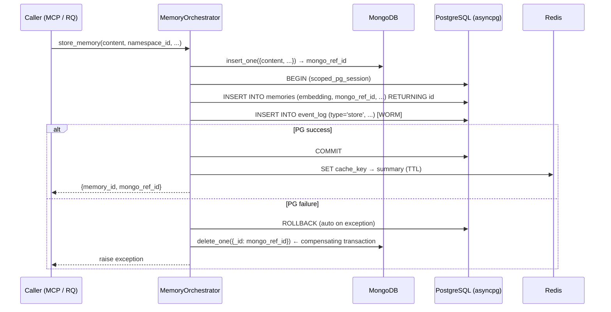
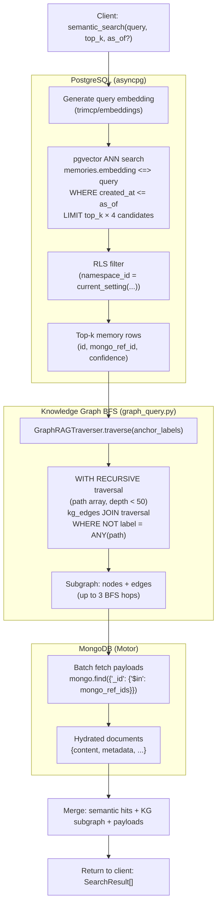

# TriMCP Database Architecture

Deep-dive into the quad-database stack: connection pooling, transaction boundaries, RLS enforcement, Saga rollbacks, and the GraphRAG hydration pipeline.

For configuration variables (pool sizes, timeouts), see [configuration_reference.md](configuration_reference.md).

---

## 1. Quad-Database Role Assignment

Each database is assigned exclusively to the data structure it is optimal for:

| Layer | Database | Client library | Role |
|---|---|---|---|
| **Semantic index** | PostgreSQL + pgvector | `asyncpg` | Vector embeddings, KG triplets, RLS-enforced tenant isolation, WORM event log |
| **Episodic archive** | MongoDB | `motor` (async) | Raw heavy payloads: transcripts, source file text, attachments |
| **Working memory & queues** | Redis | `redis.asyncio` + `redis` (sync) | Cache, RQ job queue, HMAC nonce store, quota counters |
| **Media store** | MinIO | `minio` | Binary blobs: audio, video, images, replay caches |

The `TriStackEngine` (`trimcp/orchestrator.py`) initialises and owns all four connections.

---

## 2. Connection Pools

### 2a. PostgreSQL — asyncpg pool

```python
# trimcp/orchestrator.py — TriStackEngine.connect()
self.pg_pool = await asyncpg.create_pool(
    cfg.PG_DSN,
    min_size=cfg.PG_MIN_POOL,    # PG_MIN_POOL, default 1
    max_size=cfg.PG_MAX_POOL,    # PG_MAX_POOL, default 10
    command_timeout=30,           # seconds; hard statement timeout
)
```

**Read replica** (optional): When `DB_READ_URL` differs from `PG_DSN`, a second pool (`pg_read_pool`) is created with identical sizing. Orchestrators that receive a `pg_read_pool` reference use it for `SELECT`-only paths.

**Pool acquire timeout**: Every checkout is bounded by `POOL_ACQUIRE_TIMEOUT = 10.0 s` (constant in `trimcp/db_utils.py`). This prevents event-loop stall when the pool is exhausted (FIX-010).

```python
# Never acquire without timeout:
async with pool.acquire(timeout=POOL_ACQUIRE_TIMEOUT) as conn:
    ...
```

### 2b. MongoDB — Motor

```python
self.mongo_client = AsyncIOMotorClient(
    cfg.MONGO_URI,
    serverSelectionTimeoutMS=5_000,
)
```

Motor uses a **connection pool** internally (default max 100 connections). All operations are non-blocking; Motor schedules I/O on the running asyncio event loop.

**Collection pattern**: Each content type maps to a dedicated collection:
- `memories` — episodic content blobs
- `code_chunks` — AST-parsed source code fragments
- `media` — media metadata and transcriptions
- `snapshots` — namespace export snapshots

**Indexes**: Created at startup via `TriStackEngine._init_mongo_indexes()`. Key index: `{mongo_ref_id: 1}` on each collection for O(1) lookup by the PostgreSQL foreign-key reference.

### 2c. Redis — async + sync clients

```python
self.redis_client = redis.from_url(          # redis.asyncio
    cfg.REDIS_URL,
    socket_connect_timeout=5,
    socket_timeout=5,
    max_connections=cfg.REDIS_MAX_CONNECTIONS,  # default 20
    health_check_interval=30,
)
self.redis_sync_client = redis_sync.from_url( # redis (sync, for RQ)
    cfg.REDIS_URL, ...
)
```

The **synchronous** client is required by RQ (`rq.Queue`), which uses blocking Redis commands internally. All other paths use the async client.

### 2d. MinIO

```python
self.minio_client = Minio(
    cfg.MINIO_ENDPOINT,
    access_key=cfg.MINIO_ACCESS_KEY,
    secret_key=cfg.MINIO_SECRET_KEY,
    secure=cfg.MINIO_SECURE,
)
```

MinIO operations run in a thread pool via `asyncio.to_thread()` because the `minio` Python client is synchronous.

---

## 3. Transaction Boundaries & RLS

### 3a. The scoped_pg_session pattern

All user-facing SQL must run inside a `scoped_pg_session`. This is the **only** correct way to acquire a PostgreSQL connection for tenant-scoped work:

```python
from trimcp.db_utils import scoped_pg_session

async with scoped_pg_session(pool, namespace_id=ns_id) as conn:
    # SET LOCAL trimcp.namespace_id = '<uuid>' is active here
    # All queries are RLS-filtered to ns_id
    rows = await conn.fetch("SELECT id, content FROM memories")
# Connection returned to pool; namespace context reset
```

**Implementation** (`trimcp/db_utils.py`):

```python
async with pool.acquire(timeout=POOL_ACQUIRE_TIMEOUT) as conn:
    async with conn.transaction():
        await set_namespace_context(conn, ns_uuid)   # SET LOCAL ...
        yield conn
    # Transaction commits on clean exit, rolls back on exception
```

**Why `SET LOCAL` requires a transaction**: `SET LOCAL` scopes the variable to the current transaction. Without an enclosing `BEGIN`, the variable reverts to the session default at the next statement boundary. The explicit `conn.transaction()` ensures the RLS filter is active for every statement on that connection (FIX-011).

### 3b. Admin / background paths (unmanaged)

```python
from trimcp.db_utils import unmanaged_pg_connection

async with unmanaged_pg_connection(pool) as conn:
    # No RLS — use ONLY for admin paths or background workers
    await conn.execute("...")
```

`unmanaged_pg_connection` still enforces the 10 s acquire timeout but does not set `trimcp.namespace_id`.

---

## 4. Saga Pattern — Cross-Database Write Path

Every `store_memory` or `index_code_file` ingestion spans MongoDB **and** PostgreSQL. The Saga pattern ensures both succeed or both are rolled back:



Key properties:
- **Mongo-first**: The MongoDB document is written first so the `mongo_ref_id` is available as a FK reference in the Postgres row.
- **Compensating delete**: If the Postgres `INSERT` fails (constraint violation, pool exhaustion, etc.), the MongoDB document is deleted synchronously before the exception propagates.
- **GC safety net**: The orphan garbage collector runs hourly as an independent backstop. Any Mongo document older than `GC_ORPHAN_AGE_SECONDS` with no matching `mongo_ref_id` in Postgres is purged.
- **WORM event log**: The `event_log` `INSERT` is always inside the same Postgres transaction as the `memories` `INSERT`. If either fails, both roll back together — the audit trail is never partially written (FIX-012).

---

## 5. GraphRAG Hydration Pipeline

The semantic search result enrichment flow: from a vector query in Postgres through BFS graph traversal to MongoDB payload hydration.



**Cycle guard (FIX-038)**: The recursive CTE uses a `path text[]` accumulator to prevent infinite loops on cyclic KG graphs and a `depth < 50` cap to bound query time.

**N+1 prevention**: Mongo payloads are fetched with a single `find({'_id': {'$in': ids}})` batch query, not one `find_one` per memory row (FIX-024).

---

## 6. Partitioning Strategy & Foreign Keys

Several high-volume tables use **PostgreSQL RANGE partitioning**:

| Table | Partition key | Partition by |
|---|---|---|
| `memories` | `created_at` | RANGE (monthly) |
| `event_log` | `occurred_at` | RANGE (monthly) |
| `contradictions` | `detected_at` | RANGE (monthly) |

**Constraint**: PostgreSQL requires all primary key and unique constraints on partitioned tables to include the partition key. This means child tables **cannot** declare standard `FOREIGN KEY ... REFERENCES memories(id)` — they must include `created_at` in the reference, which is impractical for application code.

**Solution** (see `architecture-v1.md` §8): TriMCP uses **application-layer consistency** enforced by:
1. Saga atomicity on every write path.
2. Trigger-based parent-FK verification on `event_log`.
3. The background GC sweeping for orphans on a configurable interval.

---

## 7. Event Log (WORM) Design

`event_log` is **append-only** (Write-Once, Read-Many). No row is ever `UPDATE`d or `DELETE`d by the application:

- All inserts go through `append_event()` in `trimcp/event_log.py`.
- `append_event()` must be called **inside** the same `conn.transaction()` as the data write — never as a fire-and-forget (FIX-012).
- An advisory-lock sequence counter ensures monotonic `event_seq` values within a namespace.
- Monthly partitions are pre-created by `trimcp_ensure_event_log_monthly_partitions()` at startup and renewed by the admin server lifespan.
- Merkle chain integrity is verified at startup via `verify_merkle_chain()`.

---

## 8. Module Map

| Module | Responsibility |
|---|---|
| `trimcp/orchestrator.py` | `TriStackEngine` — pool init, orchestrator wiring, `connect()` / `disconnect()` |
| `trimcp/db_utils.py` | `scoped_pg_session`, `unmanaged_pg_connection`, `POOL_ACQUIRE_TIMEOUT` |
| `trimcp/orchestrators/memory.py` | Memory CRUD, Saga pattern, PII integration |
| `trimcp/orchestrators/graph.py` | KG write path, GraphOrchestrator |
| `trimcp/orchestrators/temporal.py` | Temporal (as_of) query filters |
| `trimcp/orchestrators/namespace.py` | Namespace lifecycle management |
| `trimcp/graph_query.py` | `GraphRAGTraverser` — BFS recursive CTE |
| `trimcp/event_log.py` | `append_event()`, Merkle chain, `verify_merkle_chain()` |
| `trimcp/garbage_collector.py` | Keyset-paginated orphan sweep |
| `trimcp/signing.py` | HMAC-SHA256 signing, key rotation |
| `trimcp/pii.py` | PII detection / redaction pipeline |
