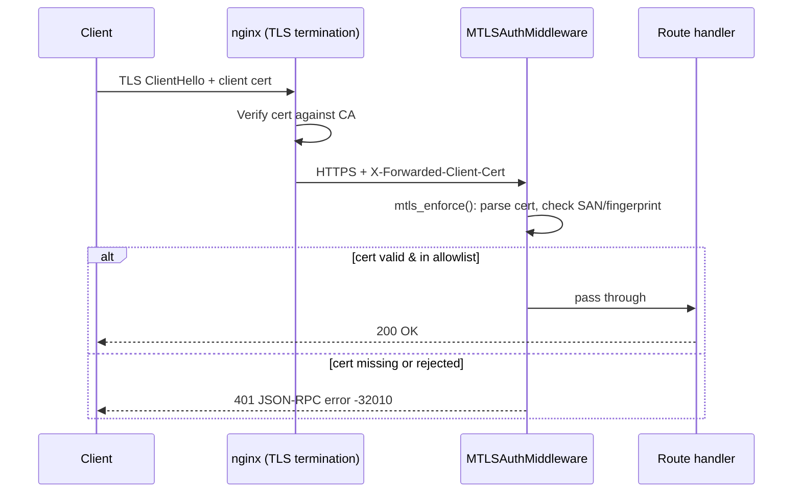

# TriMCP Enterprise Security Guide

This document covers the advanced security posture of a production TriMCP deployment: **mTLS client certificates**, **JWT/SSO integration**, **HMAC API authentication**, **signing key management**, and **RLS enforcement**.

For the basic signing and key-rotation mechanics, see [signing.md](signing.md).
For all environment variables, see [configuration_reference.md](configuration_reference.md).

---

## 1. Authentication Layers

TriMCP has three server surfaces, each with independent auth middleware stacks:

| Surface | File | Auth mechanisms |
|---|---|---|
| **MCP stdio** | `server.py` | Namespace token in tool args; admin check via `TRIMCP_ADMIN_OVERRIDE` or `TRIMCP_ADMIN_API_KEY` |
| **Admin REST API** | `admin_server.py` | HMAC-SHA256 + HTTP Basic (UI) + optional mTLS |
| **A2A JSON-RPC** | `trimcp/a2a_server.py` | JWT Bearer + optional mTLS + cryptographic grant tokens |

---

## 2. HMAC API Authentication (Admin Server)

All `/api/` routes on `admin_server.py` require an HMAC-SHA256 `Authorization` header.

### Request signing

```
Authorization: HMAC-SHA256 <timestamp>:<nonce>:<signature>
```

Where `signature = HMAC-SHA256(TRIMCP_API_KEY, "<timestamp>\n<nonce>\n<method>\n<path>\n<body_sha256>")`.

Key properties:
- **Timestamp window**: ±`TRIMCP_CLOCK_SKEW_TOLERANCE_S` seconds (default 300 s). Requests outside this window are rejected as stale.
- **Nonce replay protection**: Each nonce is stored in Redis (or an in-process set) for the clock-skew window. The same nonce cannot be reused. Enable `TRIMCP_DISTRIBUTED_REPLAY=true` to share the nonce store across multiple admin replicas.
- **Body integrity**: The SHA-256 hash of the request body is included in the signed string, preventing body substitution attacks.

### Enabling distributed replay protection

For deployments with multiple `admin_server.py` replicas behind a load balancer:

```bash
TRIMCP_DISTRIBUTED_REPLAY=true
REDIS_URL=redis://your-shared-redis:6379/0
```

---

## 3. JWT / Bearer Authentication (A2A Server)

The A2A server and agent-facing routes use JWT Bearer tokens for identity.

### HS256 (development / internal)

```bash
TRIMCP_JWT_SECRET=your-32-byte-minimum-secret
TRIMCP_JWT_ALGORITHM=HS256
```

### RS256 / ES256 (production / enterprise SSO)

Generate an RSA or EC key pair:

```bash
# RSA 4096
openssl genrsa -out private.pem 4096
openssl rsa -in private.pem -pubout -out public.pem

# EC P-256
openssl ecparam -name prime256v1 -genkey -noout -out ec_private.pem
openssl ec -in ec_private.pem -pubout -out ec_public.pem
```

Set the environment:

```bash
TRIMCP_JWT_PUBLIC_KEY="$(cat public.pem)"   # or: file:///path/to/public.pem
TRIMCP_JWT_ALGORITHM=RS256
TRIMCP_JWT_ISSUER=https://your-sso-provider.example.com
TRIMCP_JWT_AUDIENCE=trimcp-api
```

### Enterprise SSO Integration

For OIDC-based SSO (Okta, Azure AD, Ping, etc.):

1. Configure your IdP to issue RS256 JWTs with the `iss` and `aud` claims matching the values you set above.
2. Export the IdP's public key or JWKS endpoint — TriMCP validates against the static public key only (no per-request JWKS fetch; the key is loaded once at startup).
3. Set `TRIMCP_JWT_PREFIX` to the route prefix that requires the token (default `/api/v1/`).

### Per-service audience isolation

To prevent tokens issued for one service from being replayed against another, each surface can require its own `aud` claim:

```bash
TRIMCP_A2A_JWT_AUDIENCE=trimcp_a2a          # A2A server
TRIMCP_JWT_AUDIENCE=trimcp_mcp              # MCP / admin paths
```

Tokens accepted by the A2A server will be rejected by the admin server and vice versa.

---

## 4. mTLS Client Certificate Enforcement

`MTLSAuthMiddleware` (`trimcp/mtls.py`) can be applied to either the Admin server or the A2A server. It reads the client certificate from:
- **Direct TLS** (uvicorn with `--ssl-certfile`/`--ssl-keyfile`): from the ASGI `scope["ssl_object"]`.
- **Reverse proxy** (nginx / Caddy mTLS offload): from the `X-Forwarded-Client-Cert` header (controlled by `TRIMCP_*_MTLS_TRUSTED_PROXY_HOP`).

### Configuring server-side TLS

For direct TLS, launch uvicorn with:

```bash
uvicorn admin_server:app \
  --ssl-certfile /etc/tls/server.crt \
  --ssl-keyfile  /etc/tls/server.key \
  --ssl-ca-certs /etc/tls/ca.crt
```

Or use nginx/Caddy to terminate TLS and forward the client cert via `X-Forwarded-Client-Cert`.

### Nginx mTLS termination example

```nginx
server {
    listen 443 ssl;
    ssl_certificate     /etc/tls/server.crt;
    ssl_certificate_key /etc/tls/server.key;
    ssl_client_certificate /etc/tls/ca.crt;
    ssl_verify_client optional;

    location /api/ {
        proxy_pass http://admin_server:8003;
        proxy_set_header X-Forwarded-Client-Cert $ssl_client_cert;
    }
}
```

Set `TRIMCP_ADMIN_MTLS_TRUSTED_PROXY_HOP=1` so the middleware reads from the forwarded header.

### Allowlist options

You can restrict access by **Subject Alternative Name** or **certificate fingerprint** (or both):

```bash
# Allow by SAN (DNS names, lower-cased, comma-separated)
TRIMCP_A2A_MTLS_ALLOWED_SANS=agent-a.internal,agent-b.internal

# Allow by SHA-256 fingerprint (colon-separated hex)
TRIMCP_A2A_MTLS_ALLOWED_FINGERPRINTS=AA:BB:CC:...:FF
```

When both are set, a certificate must match **either** list (OR logic).
When neither is set and `strict=true`, any valid CA-signed client certificate is accepted.

### Rolling deployment (non-strict mode)

During a certificate rotation, set `strict=false` temporarily to allow connections without a client cert:

```bash
TRIMCP_A2A_MTLS_STRICT=false   # accept missing certs during roll
```

Restore `strict=true` once all clients have updated certificates.

### Authentication flow



---

## 5. Signing Key Management

All memories and events are HMAC-SHA256 signed at write time. Keys are **AES-256-GCM encrypted at rest** using `TRIMCP_MASTER_KEY`.

### Master key requirements

- **Minimum**: 32 UTF-8 bytes of random material.
- **Generation**: `openssl rand -base64 48` produces a compliant 48-byte base64 key.
- **Storage**: Use a secrets manager (AWS Secrets Manager, HashiCorp Vault, Azure Key Vault) — never commit to source control.

### Key rotation (zero downtime)

1. Call the `rotate_signing_key` MCP tool (admin auth required) or the `/api/admin/rotate-key` endpoint.
2. A new signing key is generated and encrypted with the current master key; the old key is marked `retired`.
3. All **new** writes use the new key. All **historical** records retain their original key for verification — retired keys are never deleted.
4. Verification of historical records always looks up the `signature_key_id` from the record, so old and new records verify correctly in parallel.

### Master key rotation

1. Decrypt all active + retired signing keys using the **current** master key.
2. Re-encrypt them using the **new** master key.
3. Update `TRIMCP_MASTER_KEY` in your secrets manager and restart the server.

There is no automated master-key rotation helper in v1.0 — do this offline using the `trimcp/signing.py` utilities.

---

## 6. Row-Level Security (RLS) Enforcement

RLS is enforced via a PostgreSQL session variable `trimcp.namespace_id` that must be set inside an explicit transaction before any query executes.

### The scoped session pattern

All user-facing paths use `scoped_pg_session()` from `trimcp/db_utils.py`:

```python
async with scoped_pg_session(pool, namespace_id=ns_id) as conn:
    # All queries on `conn` are automatically filtered to ns_id
    rows = await conn.fetch("SELECT * FROM memories")
```

This context manager:
1. Checks out a connection from the pool (timeout: 10 s).
2. Starts a `conn.transaction()`.
3. Issues `SET LOCAL trimcp.namespace_id = '<uuid>'` inside the transaction.
4. Resets the variable on exit via `_reset_rls_context`.

`SET LOCAL` scopes the variable to the transaction, not the session — a leaked connection cannot carry another tenant's context.

### Background workers and RLS bypass

Background workers (`garbage_collector.py`, `reembedding_worker.py`) use system-level connections that bypass RLS — this is intentional and required for cross-namespace scans. See `architecture-v1.md` §6.1 for the threat model and mitigations.

---

## 7. PII Redaction

See [pii.md](pii.md) for the full pipeline. Security summary:
- Presidio-based NER + regex fallback runs **before** payloads reach LLMs or external storage.
- Redacted values are stored encrypted (AES-256-GCM) in the `pii_redactions` table.
- The `unredact_memory` admin tool requires admin auth and uses `scoped_pg_session` (FIX-025 enforces RLS on this path).

---

## 8. Security Checklist — Production Readiness

| Item | Env var / action | Status |
|---|---|---|
| Master key set (≥ 32 bytes) | `TRIMCP_MASTER_KEY` | Required — server fails to start if missing |
| MinIO credentials from env | `MINIO_ACCESS_KEY`, `MINIO_SECRET_KEY` | Required — no defaults (FIX-013) |
| HMAC API key set | `TRIMCP_API_KEY` | Warning if absent |
| JWT configured for production | `TRIMCP_JWT_PUBLIC_KEY` + `RS256` | Recommended (vs. HS256 shared secret) |
| Admin override disabled | `TRIMCP_ADMIN_OVERRIDE` unset | Enforced at startup when `ENVIRONMENT=prod` |
| mTLS enabled on A2A | `TRIMCP_A2A_MTLS_ENABLED=true` | Recommended for production agent networks |
| mTLS enabled on Admin | `TRIMCP_ADMIN_MTLS_ENABLED=true` | Recommended for production admin surfaces |
| SMTP on port 587 with STARTTLS | `TRIMCP_SMTP_FROM`, `TRIMCP_SMTP_TO` | Enforced (FIX-052) |
| RLS enforced on all user paths | `scoped_pg_session` in orchestrators | Enforced in code |
| OpenVINO model pinned | `TRIMCP_OPENVINO_MODEL_REVISION` | Warning logged if absent |
