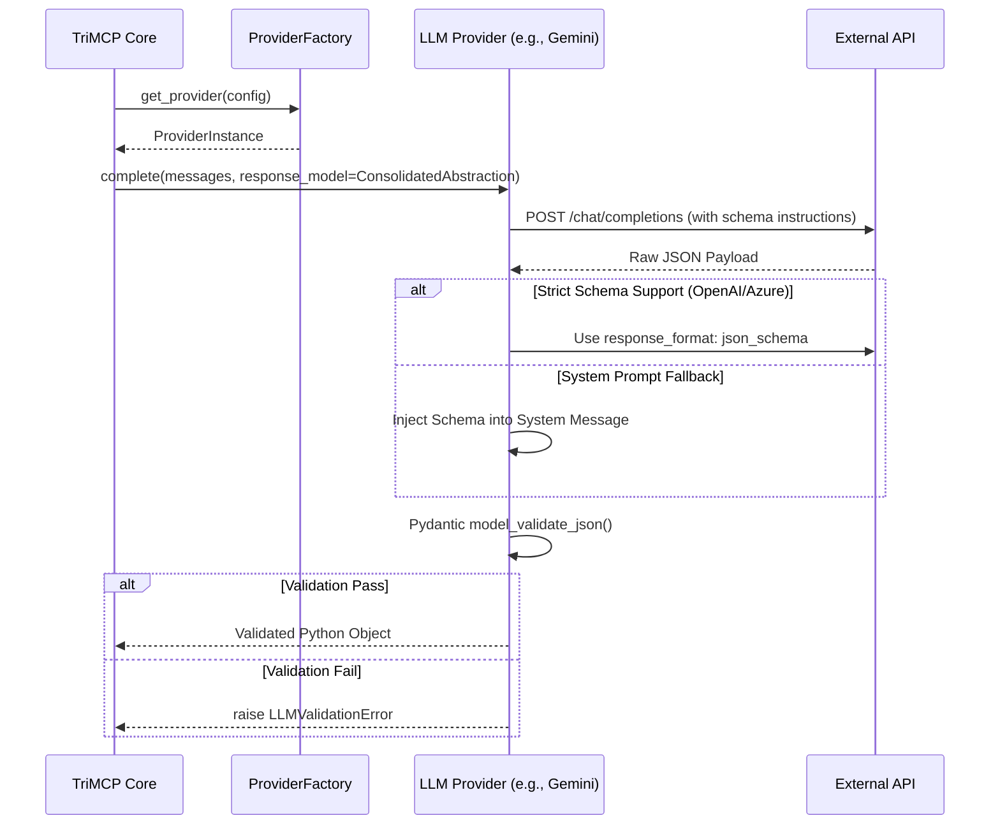

# LLM Providers and Structured Output

TriMCP is architected to be Large Language Model (LLM) provider-agnostic. It supports a diverse range of backends for embeddings, semantic search, memory consolidation, and reasoning, with mandatory schema validation for all outputs.

## Supported Providers

TriMCP currently supports the following provider labels:

| Label | Engine | Typical Use Case |
| :--- | :--- | :--- |
| `google_gemini` | Google Gemini API | Primary reasoning and consolidation. |
| `anthropic` | Anthropic Claude API | High-accuracy research and extraction. |
| `openai` | OpenAI API | General purpose reasoning. |
| `azure_openai` | Microsoft Azure | Enterprise-grade managed endpoints. |
| `deepseek` | DeepSeek API | Cost-sensitive high-performance tasks. |
| `local-cognitive-model` | llama.cpp / OpenVINO | Airgapped and edge deployments. |
| `openai_compatible` | Custom Endpoints | Self-hosted vLLM or Ollama instances. |

## Structured Output Strategy (Pydantic V2)

A core mandate of TriMCP is that LLMs must never return "loose" text for cognitive operations. Every response that modifies the system state (e.g., creating a Knowledge Graph edge) is validated against a Pydantic V2 model.

### Validation Signal Flow

## Provider Configuration

Providers are resolved in the following order:
1.  **Namespace Metadata**: `metadata["consolidation"]["llm_provider"]` allows for per-tenant model selection.
2.  **Global Default**: `TRIMCP_LLM_PROVIDER` in the environment configuration.

### Credential Resolution (BYO Keys)
TriMCP follows a "Bring Your Own Key" (BYO) model. Credentials can be provided as:
-   **Environment Variables**: `TRIMCP_GEMINI_API_KEY`, etc.
-   **References**: `ref:env/MY_CUSTOM_KEY` in namespace metadata.
-   **Vault (Phase 3)**: Secure retrieval from a secret manager (planned).

## Local Embedding Backend

For high-security or low-latency requirements, TriMCP can run embedding models locally using **Sentence-Transformers** or **Intel OpenVINO**, avoiding any external API calls for the semantic search hot path.
