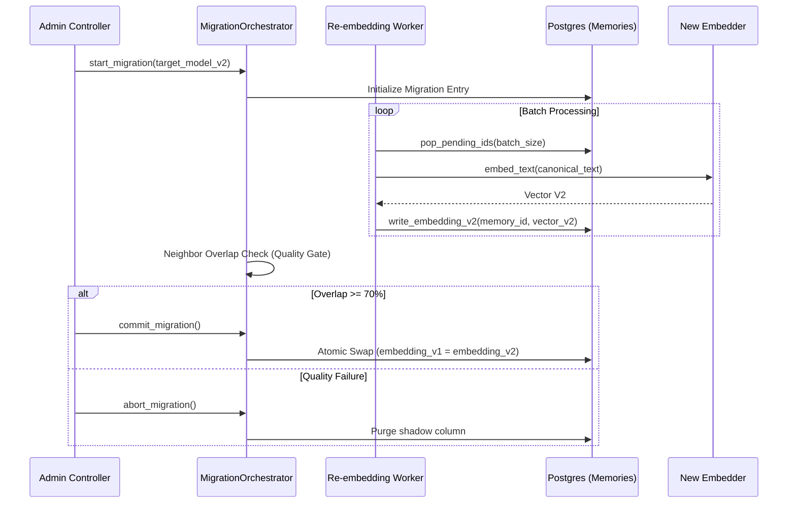

# System Migrations and Re-embedding

TriMCP is architected for evolution. It includes specialized infrastructure for managing database schema changes and the heavy task of re-embedding large memory stores when moving to new AI models.

## 1. Re-embedding Migrations (Strategy A)

When the system upgrades its embedding model (e.g., from `v1` to `v2`), existing memory vectors must be recalculated to remain valid for semantic search. TriMCP uses a **Shadow Column** strategy to ensure zero-downtime during this process.

### Re-embedding Signal Flow

## 2. Quality Gates: Neighbor Overlap

To prevent semantic drift during a model upgrade, TriMCP calculates a **Jaccard Similarity** score between the top nearest neighbors of a sample set using both models. 
-   If the neighbor overlap is below 70%, the migration is considered unstable and the system blocks the `commit` until manually reviewed.

## 3. Schema Migrations

Database schema changes are managed via idempotent SQL scripts located in `trimcp/migrations/`. 

### Key Migrations
-   **`001_enable_rls.sql`**: Configures Row-Level Security and the `trimcp_app` role.
-   **Partitioning**: High-volume tables (`memories`, `event_log`) are automatically partitioned by time range or hash to maintain performance at scale.

## 4. WORM Compliance

For enterprise auditability, the `event_log` table is configured as **WORM (Write Once, Read Many)**.
-   The `trimcp_app` role is granted `INSERT` and `SELECT` permissions but is explicitly denied `UPDATE` and `DELETE`.
-   This ensures that the causal history of the memory store cannot be tampered with by the application layer.
