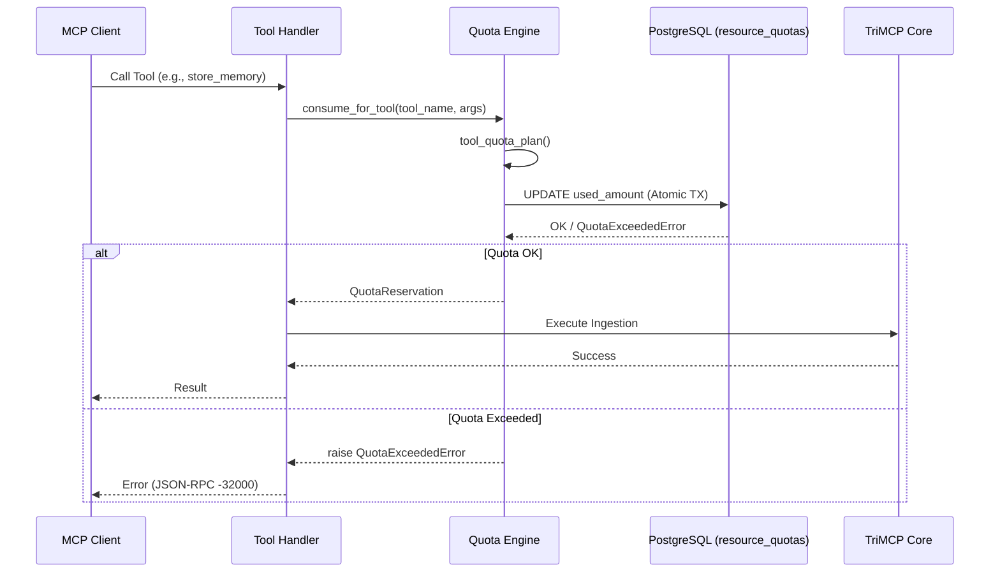

# Multi-Tenancy and Resource Quotas

TriMCP is an enterprise-grade multi-tenant memory engine. It enforces strict isolation between different namespaces while managing resource consumption through a high-performance quota system.

## Architecture of Isolation

Isolation in TriMCP is achieved through a combination of application-level logic and database-level enforcement.

1.  **Namespace Resolution**: Every request must provide a `namespace_id`. The engine resolves this ID and ensures the agent or user has authority to access it.
2.  **Row-Level Security (RLS)**: PostgreSQL Row-Level Security ensures that queries can only "see" and "touch" data belonging to the active namespace.
3.  **Encrypted Signing Keys**: Each namespace has its own signing keys for memory integrity, preventing cross-tenant spoofing.

### RLS Enforcement Flow

To ensure RLS is active, the application layer must set a session-local variable on every database connection:

```python
# Application Hook
await conn.execute("SET LOCAL trimcp.namespace_id = $1", str(namespace_id))
```

The database policy then uses this variable to filter results:

```sql
CREATE POLICY tenant_isolation_policy ON memories
FOR ALL TO trimcp_app
USING (namespace_id = current_setting('trimcp.namespace_id')::uuid);
```

## Resource Quotas

TriMCP protects its infrastructure from over-consumption or "noisy neighbor" effects via the Quota Engine (Phase 3.2).

### Quota Engine Signal Flow



### Managed Resource Types

| Resource | Key | Description |
| :--- | :--- | :--- |
| **LLM Tokens** | `llm_tokens` | Tracks tokens used for embeddings, consolidation, and contradiction checks. |
| **Storage** | `storage_bytes` | Monitors total disk usage of raw payloads and metadata. |
| **Memory Units**| `memory_count` | Limits the total number of discrete memories per namespace. |

## Configuration

Quota limits are defined in the `resource_quotas` table. If no row exists for a specific namespace/resource combination, no limit is enforced (opt-in model).

### Example: Setting a Limit

```sql
-- Set a 1GB storage limit for a namespace
INSERT INTO resource_quotas (namespace_id, resource_type, limit_amount)
VALUES ('00000000-0000-4000-8000-000000000001', 'storage_bytes', 1073741824);
```

## Best-Effort Rollback

TriMCP uses a `QuotaReservation` pattern. If a resource-consuming operation fails *after* the quota has been decremented, the system attempts to roll back the increment:

```python
reservation = await consume_for_tool(...)
try:
    await engine.perform_work()
except Exception:
    await reservation.rollback()  # Reverts counter increments
    raise
```
