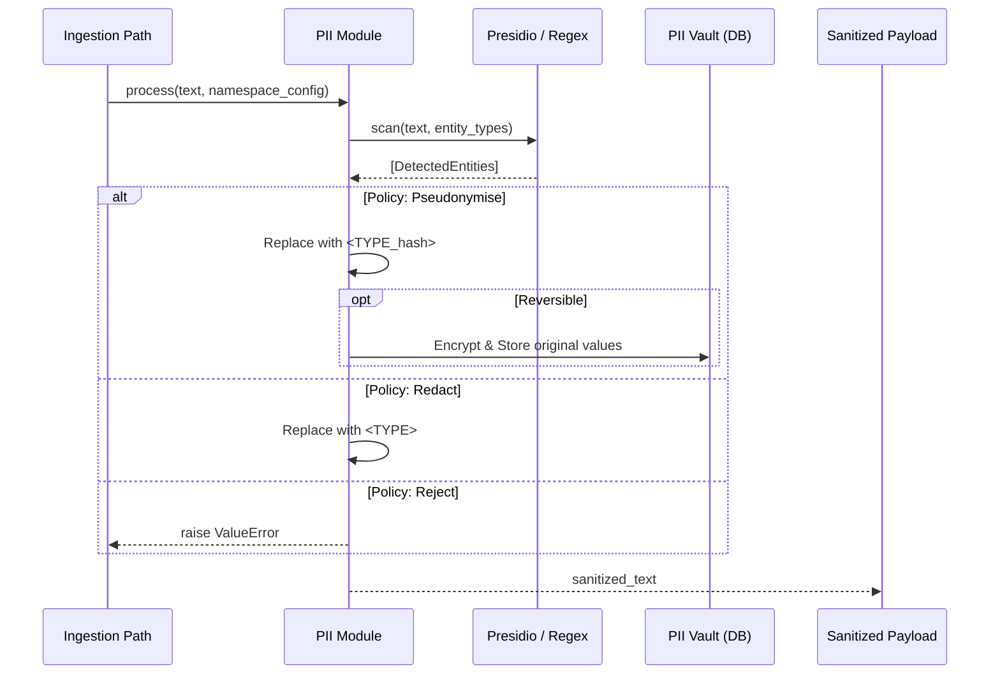

# PII Detection and Redaction

TriMCP provides an automated PII (Personally Identifiable Information) safety net. It identifies and masks sensitive data before it reaches the LLM provider or is permanently archived in long-term memory.

## The Redaction Pipeline

The PII module operates as a middleware in the ingestion path. It scans incoming text for entities like names, emails, phone numbers, and financial information.

### Redaction Signal Flow

## Detection Engines

TriMCP uses a multi-layered detection strategy:
-   **Microsoft Presidio**: The primary engine for high-confidence entity recognition using advanced NLP models.
-   **Regex Fallback**: A set of battle-tested regular expressions for common patterns (emails, credit cards, SSNs) used when NLP models are unavailable or for performance-critical paths.

## Redaction Policies

Each namespace can define its own PII policy:

| Policy | Action |
| :--- | :--- |
| **Redact** | Replaces PII with a generic label (e.g., `<PHONE_NUMBER>`). |
| **Pseudonymise** | Replaces PII with a deterministic token (e.g., `<PERSON_f3a2>`). Identical inputs yield identical tokens. |
| **Reject** | Block the entire request if any PII is detected. |
| **Flag** | Store the data as-is but mark the record as containing PII for audit. |

## Reversible Redaction (The Vault)

When a policy is marked as `reversible`, TriMCP encrypts the original sensitive values and stores them in the `pii_redactions` table. 
-   Authorized agents can call the `unredact_memory` tool.
-   The engine retrieves the encrypted values from the vault, decrypts them using the system master key, and restores them to the memory context for the specific request.
-   All unredaction events are logged to the `event_log` for security auditing.
