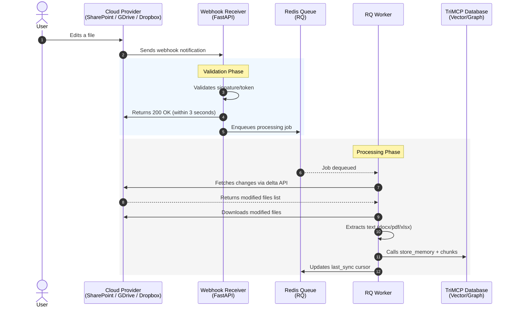

# TriMCP Push Architecture

Subscription renewal for long-lived bridges is handled by the **`trimcp.cron`** scheduler (see [architecture-v1.md](./architecture-v1.md)). The flow below shows ingest from provider webhooks through the worker.

This diagram illustrates the Document Bridge System (Push Architecture) as defined in Section 10.2 of the TriMCP Enterprise Deployment Plan.

