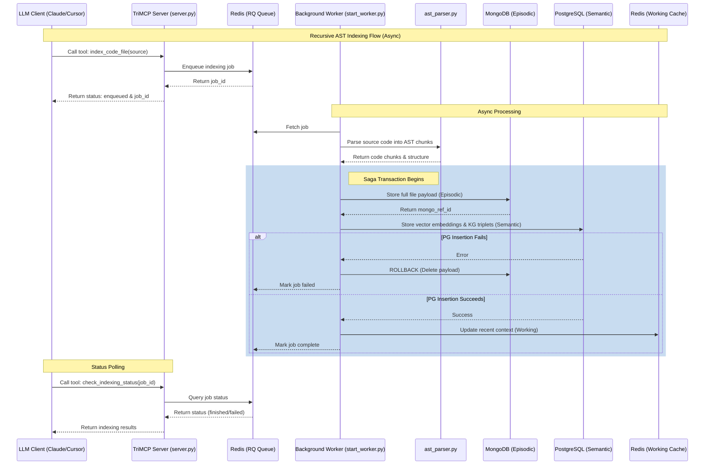

# TriMCP Recursive Indexing Flow

This document focuses on **async code indexing** via MCP + RQ. For the full **v1.0** runtime (temporal queries, A2A, scheduled re-embedding, GC), see [architecture-v1.md](./architecture-v1.md).

TriMCP can ingest its own codebase or any other directory in two ways:
1. **Ad-hoc via MCP**: An LLM client calls the `index_code_file` tool. This operation is asynchronous, utilizing an RQ-enqueued worker path.
2. **Bulk Recursive Indexing**: The `index_all.py` script bypasses the MCP protocol entirely to interface directly with the internal `TriStackEngine` for maximum throughput.

The diagram below illustrates the ad-hoc flow via MCP. It demonstrates the asynchronous processing model where the MCP server immediately returns a `job_id`, while a background worker processes the file and employs the Saga pattern to ensure database consistency across the Tri-Stack.

