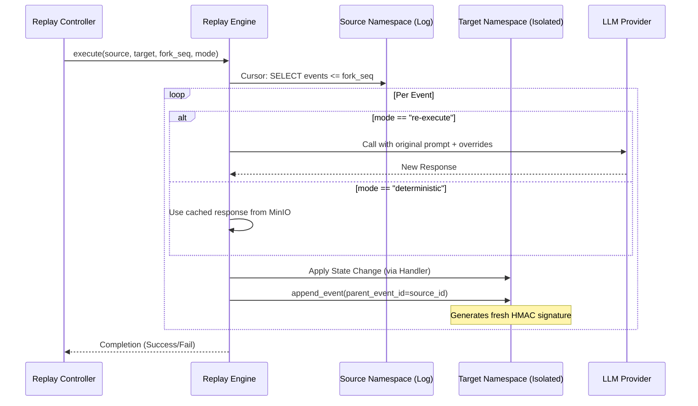

# Memory Replay Engine

The Memory Replay Engine (Phase 2.3) allows for the observational streaming and active simulation of memory timelines. It is the primary tool for debugging complex agent behaviors and testing new cognitive strategies.

## Replay Modes

TriMCP supports two distinct replay modes:

### 1. Observational Replay
A read-only, transport-agnostic stream of events. This mode allows you to "watch" the evolution of a namespace in real-time or historical playback without modifying any state.

### 2. Forked Replay (Simulation)
This mode allows you to "branch" history. It replays events from a source namespace into an isolated **target namespace**, potentially changing the outcome.

## Forked Replay Signal Flow



## Alternate Causal Provenance

A key feature of forked replay is **Alternate Causal Provenance**. 
-   When an event is replayed into a fork, it is assigned a new UUID and timestamp.
-   The `parent_event_id` field links it back to the original event in the source timeline.
-   A **fresh HMAC signature** is computed over the new event's fields.
-   This provides cryptographic proof that the event belongs to a specific simulation run, while maintaining a clear lineage to the source data.

## Replay Handlers

The engine uses a **Decorator Registry** to map event types to execution logic. Adding support for a new event type (e.g., `tool_call_result`) simply requires registering a new handler in `trimcp/replay.py`:

```python
@_register("my_new_event")
async def handle_new_event(conn, src_event, target_ns, ...):
    # Logic to apply state change to target namespace
    return {"status": "applied"}
```

## Resumption and Idempotency

Replay runs are tracked in the `replay_runs` table. If a simulation is interrupted, it can be resumed. The engine identifies the last successfully replayed event sequence and continues from the next event, ensuring no duplicate state changes are applied to the target namespace.
