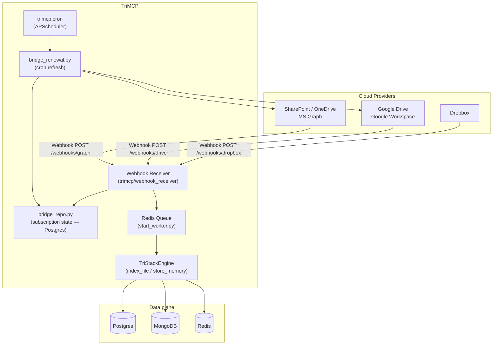
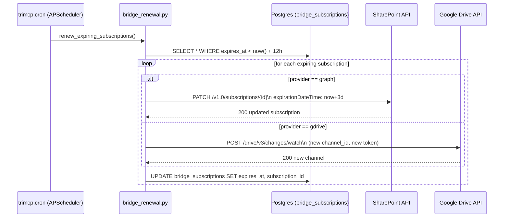
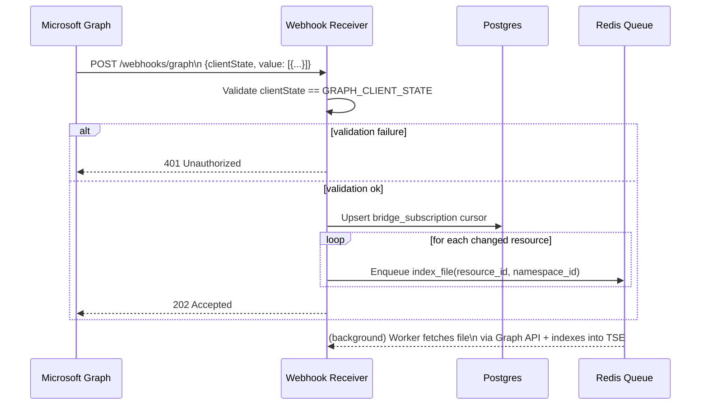
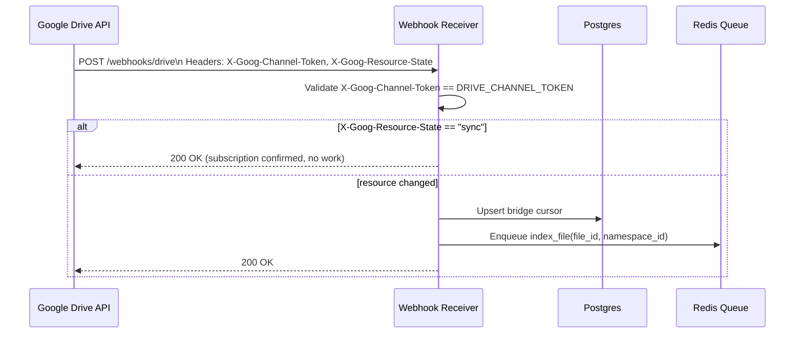
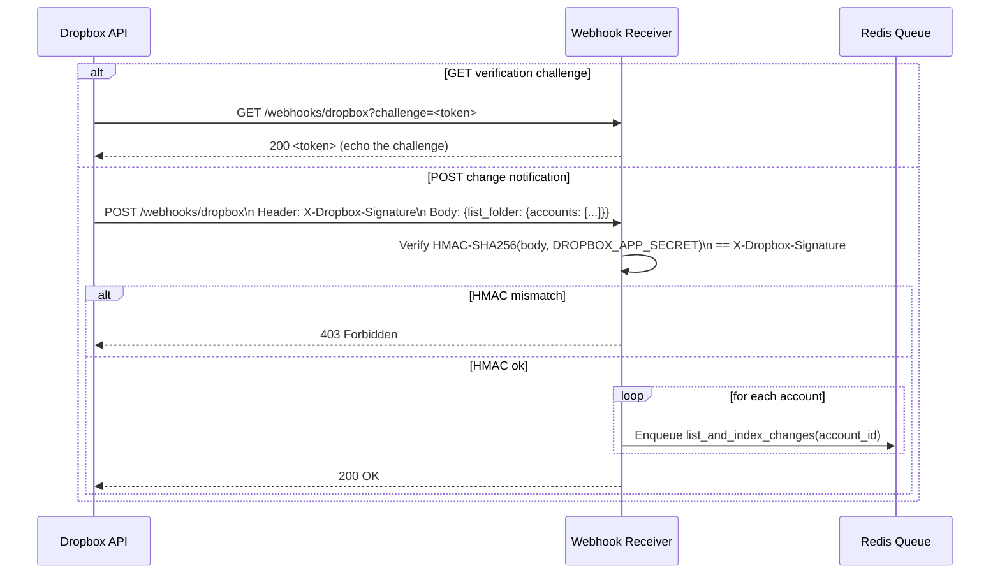

# TriMCP Service Integrations

End-to-end data flow, retry logic, and state management for all supported downstream document bridges:
**SharePoint / OneDrive** (Microsoft Graph), **Google Workspace / Drive**, and **Dropbox**.

For OAuth setup and webhook registration steps, see [bridge_setup_guide.md](bridge_setup_guide.md).
For all environment variables, see [configuration_reference.md](configuration_reference.md).

---

## 1. Architecture Overview

The bridge system uses a **push (webhook) model**: TriMCP registers a subscription with each cloud provider, and the provider delivers change notifications to TriMCP's webhook receiver. Only changed documents are re-indexed — no polling waste.



---

## 2. Subscription Lifecycle

Bridge subscriptions have **finite lifetimes** set by each provider:

| Provider | Max subscription lifetime | Renewal approach |
|---|---|---|
| SharePoint / OneDrive | 3 days | Cron job calls `PATCH /v1.0/subscriptions/{id}` before expiry |
| Google Drive | 7 days | Cron job calls `POST .../watch` with new channel ID |
| Dropbox | Permanent | No renewal needed; monitor for app re-authorizations |

The `bridge_renewal.py` cron job runs every `BRIDGE_CRON_INTERVAL_MINUTES` minutes (default 45).
It queries `bridge_subscriptions` for entries expiring within `BRIDGE_RENEWAL_LOOKAHEAD_HOURS` (default 12 h).



---

## 3. Incoming Webhook Flow (Per Provider)

### 3a. SharePoint / OneDrive (MS Graph)



**Validation token handshake** (subscription creation only):
When MS Graph sends a `validationToken` query parameter, the receiver echoes it back with `text/plain` within 10 seconds. This is handled automatically by the webhook receiver.

### 3b. Google Drive



### 3c. Dropbox



---

## 4. Retry Logic & Error Handling

Retries are handled at two layers:

### 4a. Webhook receiver layer (immediate)

The webhook receiver always returns **2xx to the provider immediately** (before the indexing worker runs). This prevents the provider from interpreting an indexing failure as a delivery failure and re-sending the same notification thousands of times.

If the receiver fails to enqueue to Redis (queue full or Redis down), it logs an error and returns `503` — the provider will retry delivery according to its own back-off policy.

### 4b. RQ worker layer (async)

The `index_file` RQ job handles indexing failures with TriMCP's standard retry policy:

| Attempt | Back-off | Behaviour |
|---|---|---|
| 1–`TASK_MAX_RETRIES` | Exponential with full jitter | Retry automatically |
| > `TASK_MAX_RETRIES` | — | Route to `dead_letter_queue` table, emit alert |

**Dead-letter queue**:
Failed jobs land in the `dead_letter_queue` Postgres table with the job payload, error message, and attempt count. Operators can inspect and replay from the admin UI or via the admin API.

---

## 5. State Model

Bridge state is tracked in two Postgres tables:

### `bridge_subscriptions`

| Column | Type | Description |
|---|---|---|
| `id` | UUID | Internal ID |
| `namespace_id` | UUID | Owning namespace (RLS enforced) |
| `provider` | text | `graph`, `gdrive`, `dropbox` |
| `subscription_id` | text | Provider-assigned subscription / channel ID |
| `resource_id` | text | Drive / site / folder being watched |
| `cursor` | text | Change cursor / delta token for incremental fetches |
| `expires_at` | timestamptz | Subscription expiry; NULL for Dropbox (permanent) |
| `status` | text | `active`, `expired`, `error` |
| `access_token` | bytea | Encrypted OAuth token (AES-256-GCM) |
| `refresh_token` | bytea | Encrypted refresh token |

### `bridge_events` (via `event_log`)

Every webhook delivery and indexing action is recorded as a signed event in the WORM `event_log`, providing a tamper-evident audit trail of all bridge activity.

---

## 6. Local Development Without a Public URL

Webhooks require a public HTTPS endpoint. For local development, use a tunneling tool:

```bash
# ngrok example
ngrok http 8003
# Copy the HTTPS URL and set:
export BRIDGE_WEBHOOK_BASE_URL=https://<ngrok-id>.ngrok.io
```

When no `BRIDGE_WEBHOOK_BASE_URL` is set, the webhook receiver is still available but subscription registration will fail. The system falls back to **scheduled pull** mechanisms: the cron job polls for changes instead of waiting for push notifications. This is lower frequency but functionally equivalent for development.
