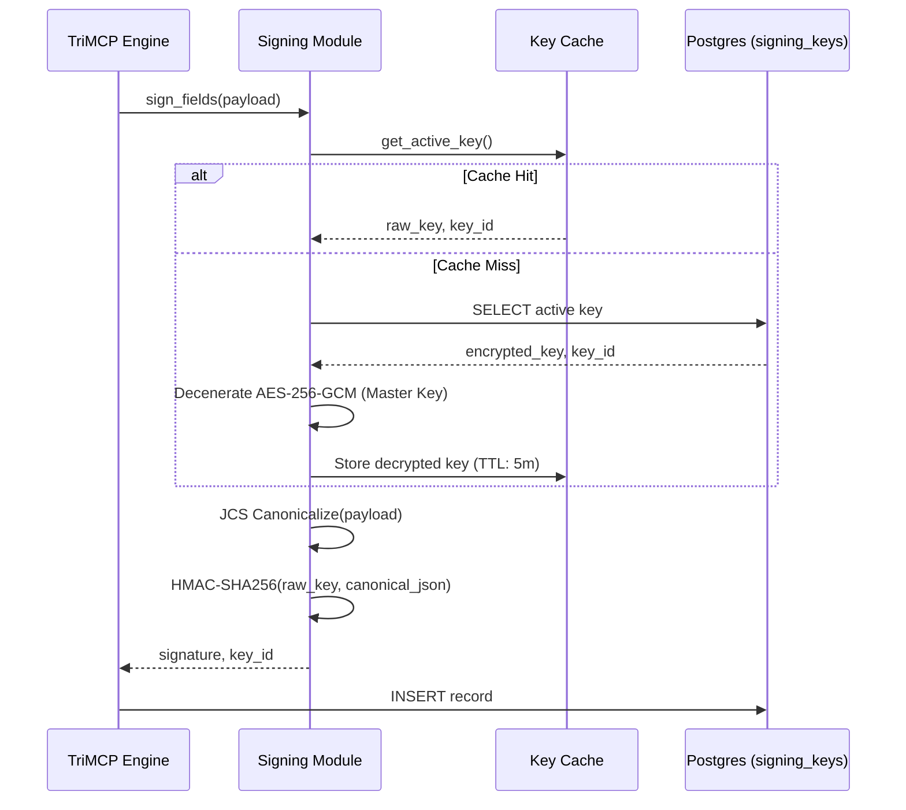

# Cryptographic Signing and Integrity

TriMCP maintains a tamper-evident audit trail for every memory and event. This is achieved through a mandatory HMAC-SHA256 signing layer that guarantees both integrity and causal provenance.

## The Signing Mechanism

Every record in the `memories` and `event_log` tables includes a `signature` and a `signature_key_id`.

### Write-Path Signal Flow

## Key Management and Security

### 1. Master Key (TRIMCP_MASTER_KEY)
Signing keys are not stored in plaintext. They are encrypted using **AES-256-GCM** with a Master Key provided at startup.
-   The server will **refuse to start** if `TRIMCP_MASTER_KEY` is missing or less than 32 characters.
-   The master key is derived via SHA-256 to ensure it matches the 32-byte requirement of AES-256.

### 2. JCS Canonicalization (RFC 8785)
To ensure the signature is deterministic, TriMCP uses the **JSON Canonicalization Scheme (JCS)**. This ensures that even if keys in the JSON payload are reordered or whitespace changes, the resulting byte array used for signing remains identical.

### 3. Key Rotation
TriMCP supports zero-downtime key rotation via the `rotate_key()` function.
-   Retired keys are kept in the database to allow verification of historical records.
-   New records always use the latest `active` key.

## Verification

During memory recall or event replay, the system can verify any record by:
1.  Retrieving the `signature_key_id` from the record.
2.  Fetching the corresponding signing key (active or retired).
3.  Re-computing the HMAC-SHA256 and comparing it to the stored signature.

Any mismatch indicates that the data has been modified since it was originally written to the stack.
