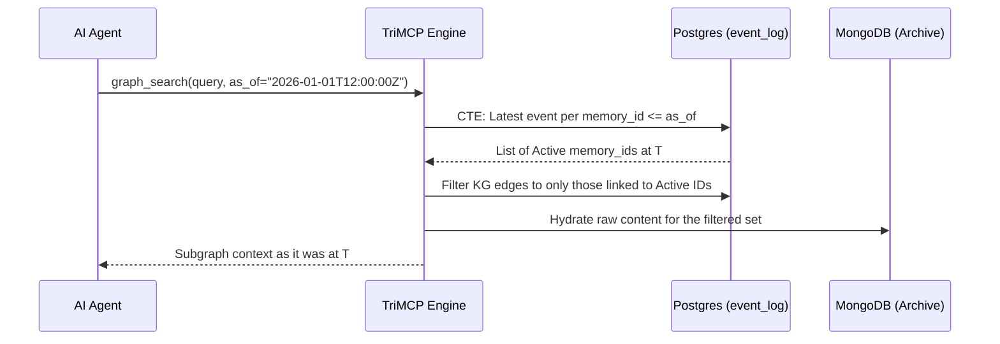

# Memory Time Travel

Time Travel is a core capability of TriMCP that allows agents and administrators to query the memory store as it existed at any specific point in history.

## The Temporal Foundation

Time travel is built upon TriMCP's **WORM (Write Once, Read Many) Event Log**. Unlike traditional databases that overwrite state, TriMCP logs every memory creation, update, or deletion as a discrete, immutable event.

## How it Works: `as_of` Queries

The `semantic_search`, `graph_search`, and `get_recent_context` tools all support an optional `as_of` parameter (ISO-8601 timestamp).

### State Reconstruction Signal Flow

When a query is received with an `as_of` timestamp, the engine performs a "Temporal Reconstruction":

## Reconstruction Rules

The engine applies the following logic to reconstruct the "Active Set" at time $T$:
1.  **Include**: Any memory where the latest event before $T$ is `store_memory`.
2.  **Exclude**: Any memory where the latest event before $T$ is `forget_memory` or if no events exist before $T$.
3.  **Update**: Use the salience score and embeddings provided by the most recent `boost_memory` or `re_embed` event before $T$.

### MongoDB Versioning (Technical Detail)
While MongoDB stores the "heavy" payload, the **PostgreSQL Event Log** serves as the authoritative version index. Every state change (even re-embedding Strategy A) creates a new event row. During reconstruction, TriMCP uses the `payload_ref` from the matched event log entry to hydrate the correct version of the raw data from MongoDB, ensuring bit-identical historical recall.

## Use Cases

-   **Auditing and Forensic Analysis**: Investigate the exact information an agent had when it made a specific decision.
-   **Regression Testing**: Test agent behavior against historical datasets without manually resetting the database.
-   **Scenario Simulation**: Provide a baseline for "What-If" analysis using the Memory Replay Engine.

## Snapshotting (Planned)

While `as_of` allows querying arbitrary points in time, TriMCP also supports **Named Snapshots**. Administrators can tag specific timestamps (e.g., `pre-migration-v2`) to provide stable references for agents to use in their queries.
